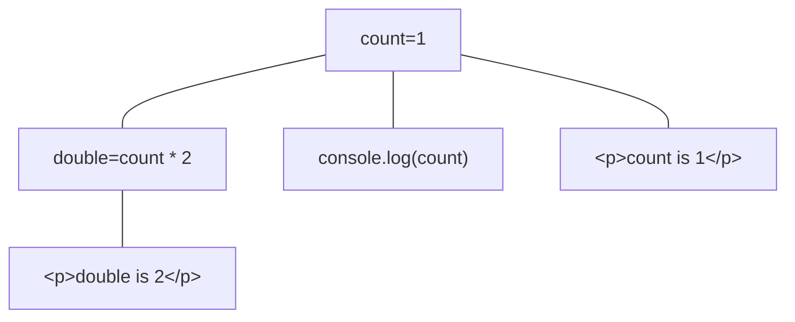
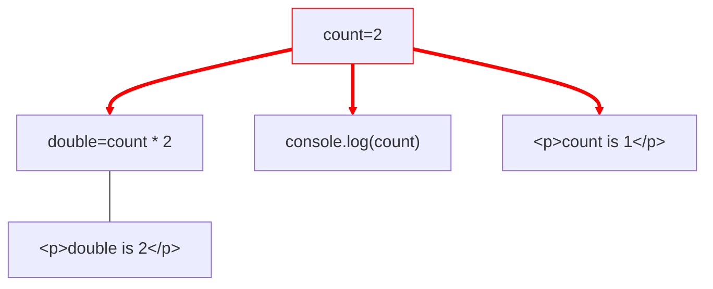
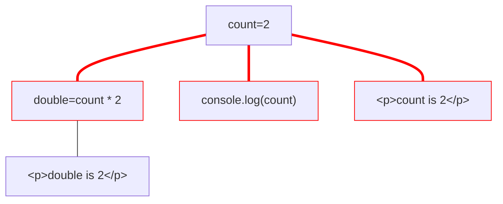
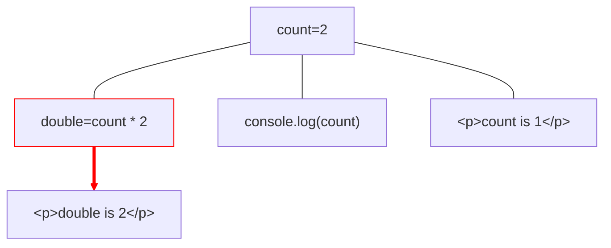
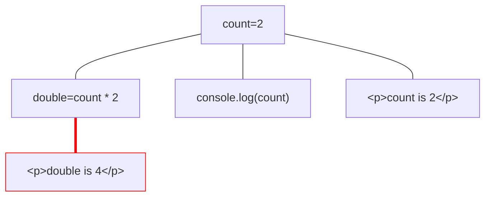

# Signals?

```js
const vue = ref(0)
const [solid, setSolid] = createSignal(0)
const preactOrAngular = signal(0)
const svelte = $state(0)
```

---
layout: center
transition: fade
---

# Signals under panseret



---
layout: center
transition: fade
---

# Signals under panseret



---
layout: center
transition: fade
---

# Signals under panseret



---
layout: center
transition: fade
---

# Signals under panseret



---
layout: center
---

# Signals under panseret



---

# Signals fordeler

- Mer effektiv DOM oppdatering
- Frikoblet fra komponent

````md magic-move
```jsx
function Counter() {
  const [count, setCount] = createSignal(0)
  function increment() {
    setCount(count() + 1)
  }

  return (
    <>
      <span>Count is {count()}</span>
      <button onClick={increment}>Bump</button>
    </>
  );
}
```
```jsx
const [count, setCount] = createSignal(0)
function increment() {
  setCount(count() + 1)
}

function Counter() {
  return (
    <>
      <span>Count is {count()}</span>
      <button onClick={increment}>Bump</button>
    </>
  );
}
```
```jsx
import { count, increment } from './store.ts'

function Counter() {
  return (
    <>
      <span>Count is {count()}</span>
      <button onClick={increment}>Bump</button>
    </>
  );
}
```
````

---

# Signals?

<section class="options">

<div>
Re-run med dependency arrays

```jsx
const [count, setCount] = useState(0)

useEffect(() => {
  console.log(count)
}, [count])
```

<section v-click="1">
  <logos-react/>
</section>
</div>
<div>
Signal

```jsx
const [count, setCount] = createSignal(0)

createEffect(() => {
  console.log(count())
})
```

<section v-click="1">
  <logos-vue />
  <logos-solidjs-icon />
  <logos-preact />
  <logos-angular-icon />
  <logos-svelte-icon class="opacity-80"/>
</section>
</div>
</section>
