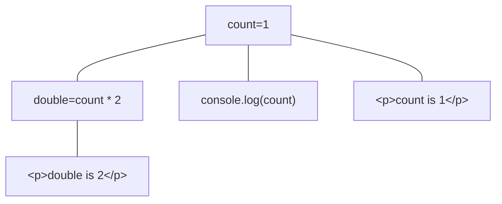
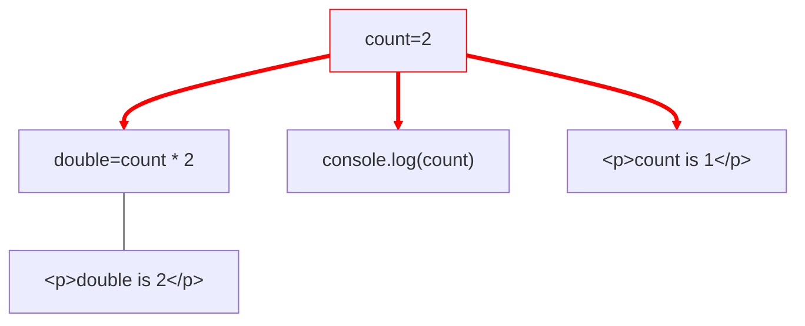
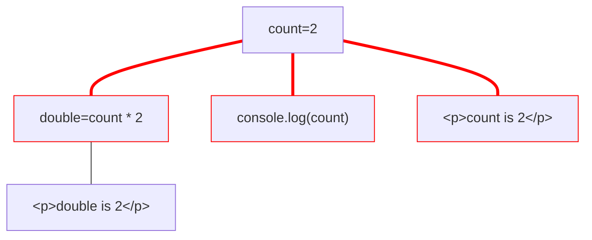
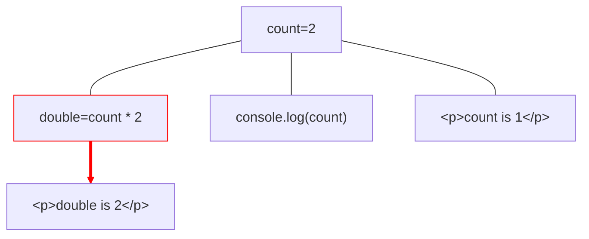
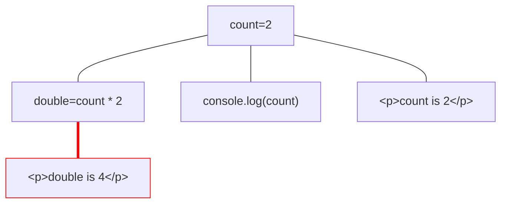

# Hvilket frontendrammeverk skal man velge?

<logos-react v-motion class="text-8xl" :initial="{ x: 1200, y: 500, scale: 0.2 }" :enter="{ x: 0, y: 0, scale: 1, transition: { duration: 7000, delay: 1000 } }"/>

<!--
Vi må slutte å velge React kun basert på at det er det flest folk kan. Det gjør at React har blitt en standard, så flere føler de må lære React for å følge jobbmarkedet og boblen blir da bare større. Det er en ond spiral! Jeg sier ikke at React er et feil valg, men du må velge det for de riktige grunnene i såfall.
-->

---
layout: center
transition: fade
---

# Signals under panseret

---
layout: center
transition: fade
---

# Signals under panseret

---
layout: center
transition: fade
---

# Signals under panseret

---
layout: center
transition: fade
---

# Signals under panseret

---
layout: center
---

# Signals under panseret

---

<BarChart title="Hello world size" postfix="kB" :bars="[
  { name: 'React', points: 39.16 }, 
  { name: 'Vue', points: 16.48 }, 
  { name: 'Angular', points: 35.77 },
  { name: 'Svelte', points: 1.67 },
  { name: 'Preact', points: 4.12 },
  { name: 'Solid', points: 2.47 },
  ]"/>

---

# Gautes tanker om React

- Best på popularitet og økosystem
- "React isn’t great at anything except being popular"

---

# Gautes tanker om Vue

- Ikke best på noe, men i toppen på alt

---

# Gautes tanker om Angular

- Har føltes litt tungt med mye boilerplate
- Har tatt gjort store forbedringer i det siste

---

# Gautes tanker om Svelte

- Hadde vært mitt valg om det ikke var for Vue
- Versjon 5 blir et skifte

---

# Gautes tanker om Solid

- Nytt og bedre JSX rammeverk
- Lite team og økosystem

---

# Gautes tanker om Preact

- Et bedre alternativ til React med mindre økosystem

---

# Vue bidrar økosystemet bidrar utover

<logos-vitejs class="text-6xl translate-x-20 translate-y-30"/>
<logos-react class="text-3xl translate-x--15 translate-y-10"/>
<logos-remix-icon class="bg-white text-3xl"/>
<logos-angular-icon class="text-3xl translate-x-12 translate-y-5"/>
<logos-solidjs-icon class="text-3xl translate-x--45 translate-y-37"/>
<logos-preact class="text-3xl translate-y-23"/>
<logos-svelte-icon class="text-3xl translate-x--10 translate-y-40"/>
<logos-qwik-icon class="text-3xl translate-x--35 translate-y-50"/>
<logos-lit-icon class="text-3xl translate-x--65 translate-y-50"/>
<Arrow x1="130" y1="220" x2="100" y2="200" />
<Arrow x1="180" y1="215" x2="180" y2="180" />
<Arrow x1="215" y1="215" x2="245" y2="190" />
<Arrow x1="215" y1="245" x2="265" y2="245" />
<Arrow x1="210" y1="270" x2="265" y2="295" />
<Arrow x1="185" y1="290" x2="210" y2="320" />
<Arrow x1="160" y1="290" x2="150" y2="320" />
<Arrow x1="140" y1="270" x2="100" y2="285" />

<logos-astro-icon class="bg-white text-3xl translate-x-80 translate-y-25"/>
<logos-mdx class="text-4xl translate-x-100 translate-y-25"/>
<Arrow x1="430" y1="300" x2="400" y2="340" />
<Arrow x1="470" y1="300" x2="500" y2="340" />

<logos-analog class="text-3xl translate-x-165 translate-y--10"/>
<Arrow x1="670" y1="300" x2="650" y2="350" />
<Arrow x1="720" y1="300" x2="730" y2="350" />
