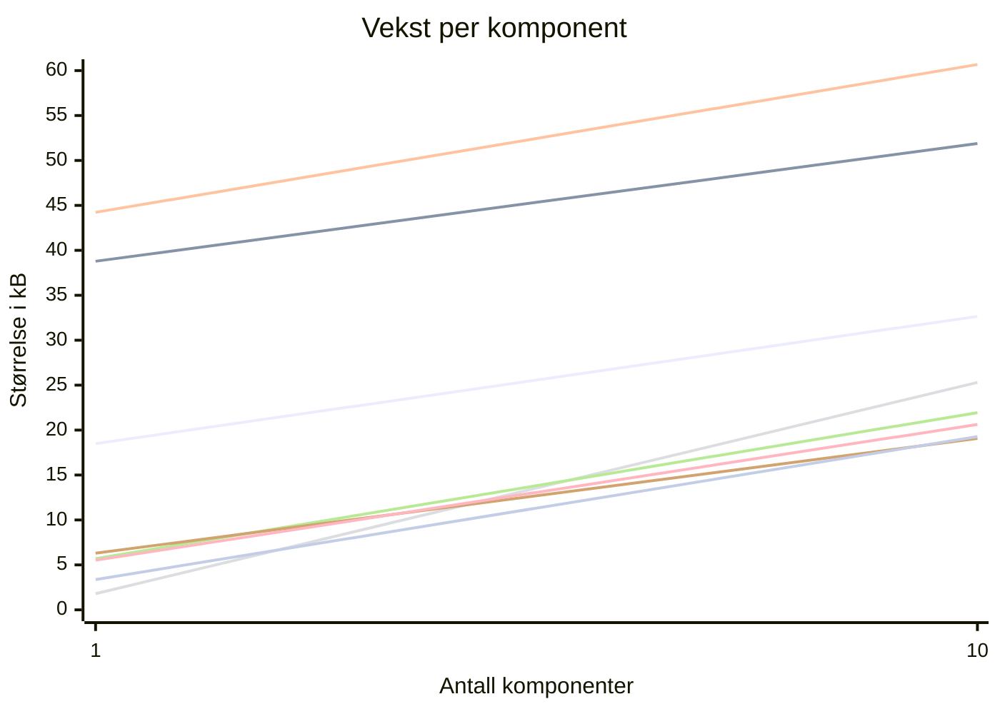
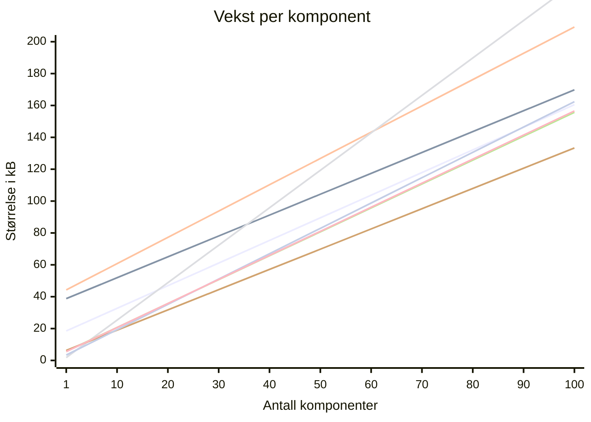

<div class="bg"></div>

# Sånn gjør du riktig valg av frontendrammeverk i 2024

<logos-vue class="text-6xl translate-x-20 translate-y-5 opacity-50"/>
<logos-react class="text-6xl translate-x-15 translate-y--65  opacity-50"/>
<logos-svelte-icon class="text-6xl translate-x--80 translate-y--70  opacity-50"/>
<logos-angular-icon class="text-6xl translate-x--90 translate-y-20  opacity-50"/>
<logos-solidjs-icon class="text-6xl translate-x-5 translate-y-15  opacity-50"/>
<logos-preact class="text-6xl translate-x-10 translate-y--70  opacity-50"/>
<logos-lit-icon class="text-6xl translate-x-40 translate-y--58  opacity-50"/>

<style>
  h1 {
    font-weight: bold;
    font-size: 4rem !important;
    translate: 0 30px;
    color: black;
  }

  .bg {
    background-image: linear-gradient(120deg, #f6d365 0%, #fda085 100%);
    position: absolute;
    inset: 0;
    z-index: -1;
  }
</style>

---
layout: cover
class: text-center
---

<div class="bg"></div>

<logos-vue class="text-7xl translate-y--25" />
<logos-react class="text-7xl translate-y--25" />
<logos-svelte-icon class="text-7xl translate-y--25" />
<logos-angular-icon class="text-7xl translate-y--25" />
<logos-solidjs-icon class="text-7xl translate-y--25" />
<logos-preact class="text-7xl translate-y--25" />
<logos-lit-icon class="text-7xl translate-y--25" />

<style>
  .bg {
    background-image: linear-gradient(120deg, #f6d365 0%, #fda085 100%);
    position: absolute;
    inset: 0;
    z-index: -1;
  }
</style>

---

<div class="row">
  <div class="column">
    
    <h1>Gaute Meek Olsen</h1>
  </div>
  
</div>

<style>
.row{
  display: flex;
  justify-content: center;
  align-items: center;
  height: 100%;
  gap: 5rem;
}

.column{
  display: grid;
  place-items: center;
}

img.me{
  height: 320px;
  border-radius: 40px;
  object-fit: contain;
}

img.capra {
  height: 250px;
  object-fit: contain;
}

h1{
  font-size: 3rem;
}
</style>

---

Hvorfor er det jeg som står her?

<section>
<table>
  <thead>
    <tr>
      <td>Jobb</td>
      <td>Fritid</td>
      <td>Talks</td>
    </tr>
  </thead>
  <tbody>
    <tr>
      <td v-click="1">2019-2020, Sparebank 1: <logos-react/></td>
      <td v-click="2">gaute.dev: <logos-vue/></td>
      <td v-click="3">2022: Hvilket frontend rammeverk liker du?</td>
    </tr>
    <tr>
      <td v-click="1">2020-*, Gjensidige: <logos-react/></td>
      <td v-click="2">ordle.no: <logos-vue/></td>
      <td v-click="3">2023: Reaktivitet i rammeverk og hva greia med signals er</td>
    </tr>
    <tr>
      <td v-click="1"></td>
      <td v-click="2">kuizzi.app: <logos-vue/></td>
      <td v-click="3">2024: Sånn gjør du riktig valg av frontendrammeverk i 2024</td>
    </tr>
  </tbody>
</table>
</section>

<style>
  td {
    min-width: 250px;
  }
</style>

---

# Hva er et frontend rammeverk?

- Abstraksjon
- Oppsett/struktur for å lage HTML, JS og CSS
- Lar deg utvikle UI komponenter
- Holder på data
- Reaktiv UI basert på data
- ++

---

# Hva er viktig å vurdere?

- Utvikler opplevelse
- Lærings kurve
- Dokumentasjon
- Performance
- Bundle size
- Skalerbarhet
- Økosystemet
- Tåler tidas tann
- Jobbmuligheter/Ansettelsesmuligheter

<!-- Source https://joshcollinsworth.com/blog/self-fulfilling-prophecy-of-react -->

---

# Hva er viktig å vurdere?

- Utvikler opplevelse
  - Lærings kurve
  - Dokumentasjon
- Performance
  - Bundle size
  - Skalerbarhet
- Popularitet
  - Økosystemet
  - Tåler tidas tann
  - Jobbmuligheter/Ansettelsesmuligheter

---

# Hva er viktig å vurdere?

- Utvikler opplevelse
- Performance
- Popularitet

---

# Hvem er du?

<section>
  <div v-click>
    
    <p>Solo prosjekt</p>
  </div>
  <div v-click>
    
    <p>Team</p>
  </div>
  <div v-click>
    
    <p>Bedrift med flere team</p>
  </div>
</section>

<style>
  section {
    margin-top: 100px;
    display: flex;
    justify-content: space-between;
  }

  section div {
    display: flex;
    flex-direction: column;
    align-items: center;
  }
</style>

---
src: ./pages/framework-intro.md
---

---
layout: center
---

# DX - Utvikler opplevelse

---
src: ./pages/mental-model.md
---
---

# Template

<section class="options grid">

<div>
HTML fil

```html
<p>Kode24-dagen {{version}}</p>
```

<section v-click="1">
  <logos-angular-icon/>
  <logos-vue class="opacity-80"/>
</section>
</div>
<div>
template literals

```js
const version = 0
return html`
  <p>Kode24-dagen ${this.version}</p>
`
```

<section v-click="1">
  <logos-angular-icon/>
  <logos-lit-icon />
</section>
</div>
<div>
JSX

```jsx
function MyComponent() {
  const version = 3
  return (
    <p>Kode24-dagen {version}</p>
  );
}
```

<section v-click="1">
  <logos-react/>
  <logos-preact />
  <logos-solidjs-icon />
  <logos-vue class="opacity-80"/>
</section>
</div>
<div>
Single File Component (SFC)

```svelte
<script>
const version = 3
</script>

<p>Kode24-dagen {version}</p>

<style></style>
```

<section v-click="1">
  <logos-vue />
  <logos-svelte-icon />
</section>
</div>
</section>

<style>
  .file {
    margin-top: 0 !important;
    margin-bottom: 0 !important;
    font-size: 0.5rem;
  }
</style>

---

# Hvordan liker du å skrive dynamisk template?

<section class="options grid">

<div>
JS

```jsx
{ isDay && <p>☀️</p> }
```

</div>
<div>
Directive

```vue
<p v-if="isDay">☀️</p>
```

</div>
<div>
Control flow

```svelte
{#if isDay}
  <p>☀️</p>
{/if}
```

</div>
<div>
dedicated components

```jsx
<Show when={isDay}>
  <p>☀️</p>
</Show>
```

</div>
</section>

---

# Hvordan liker du å skrive dynamisk template?

<section class="options grid">

<div>
JS

```jsx
<ul>
  {todos.map(todo => 
    <li>{todo.text}</li>
  )}
</ul >
```

<section v-click="1">
  <logos-react/>
  <logos-preact />
  <logos-lit-icon />
</section>
</div>
<div>
Directive

```html
<ul>
  <li v-for="todo in todos">{{todo.text}}</li>
</ul>
```

<section v-click="1">
  <logos-vue />
  <logos-angular-icon class="opacity-80"/>
</section>
</div>
<div>
Control flow

```html
<ul>
  @for (todo of todos) {
    <li>{{ todo.text }}</li>
  }
</ul>
```

<section v-click="1">
  <logos-angular-icon />
  <logos-svelte-icon />
</section>
</div>
<div>
dedicated components

```jsx
<For each={todos()}>
  {todo =>
    <li>{todo.text}</li>
  }
</For>
```

<section v-click="1">
  <logos-solidjs-icon />
</section>
</div>
</section>

---
src: ./pages/signals.md
---
---

# Mutable vs immutable

<section class="options">

<div>
Immutable

```js
const [count, setCount] = useState(0)
setCount(count + 1)
```

</div>
<div>
Mutable

```js
const count = ref(0)
count.value++
```

</div>
</section>

---

# Mutable vs immutable

<section class="options">

<div>
Immutable

```js
const [person, setPerson] = useState({ name: 'Gaute', age: 32 })
setPerson({
  ...person,
  age: person.age + 1,
})
```

<section v-click="1">
  <logos-react/>
  <logos-solidjs-icon />
  <logos-angular-icon />
  <logos-preact class="opacity-60"/>
</section>
</div>
<div>
Mutable

```js
const person = reactive({ name: 'Gaute', age: 32 })
person.age++
```

<section v-click="1">
  <logos-vue />
  <logos-svelte-icon />
  <logos-preact />
  <logos-lit-icon />
  <logos-angular-icon class="opacity-60"/>
</section>
</div>
</section>

---

# Stabilitet og innovasjon

<Arrow x1="100" y1="200" x2="850" y2="200" />
<Arrow x1="800" y1="200" x2="100" y2="200" />

<p class="translate-x-20 translate-y-18">Lite endringer</p>
<p class="translate-x-168 translate-y-8">Innovasjon</p>

<logos-react class="text-4xl translate-y-10 translate-x-60" v-click="1"/>
<logos-vue class="text-4xl translate-y-10 translate-x-110" v-click="4"/>
<logos-solidjs-icon class="text-4xl translate-y-10 translate-x-50" v-click="2"/>
<logos-angular-icon class="text-4xl translate-y-10 translate-x-130" v-click="5"/>
<logos-svelte-icon class="text-4xl translate-y-10 translate-x-130" v-click="6"/>
<logos-preact class="text-4xl translate-y-10 translate-x-30" v-click="3"/>

---
layout: center
---

# Popularitet og økosystem

---

<BarChart title="NPM weekly downloads" :bars="[
  { name: 'React', points: 22_400_000 }, 
  { name: 'Vue', points: 4_800_000 }, 
  { name: 'Angular', points: 3_300_000 },
  { name: 'Svelte', points: 1_000_000 },
  { name: 'Preact', points: 3_500_000 },
  { name: 'Solid', points: 320_000 },
  { name: 'Lit', points: 1_600_000 },
  ]"/>

---

<BarChart title="State of JS 22 - Usage" postfix="%" :bars="[
  { name: 'React', points: 82 }, 
  { name: 'Vue', points: 46 }, 
  { name: 'Angular', points: 49 },
  { name: 'Svelte', points: 21 },
  { name: 'Preact', points: 13 },
  { name: 'Solid', points: 6 },
  { name: 'Lit', points: 6 },
  ]"/>

<div v-click>


Popularitet gir fordeler i blant annet:
- Antall Utviklere/jobber
- Antall NPM pakker
  - state
  - UI-bibliotek
- Antall meta-rammeverk

</div>

---
layout: center
---

# Performance

---

<BarChart title="Hello world size" postfix="kB" :bars="[
  { name: 'React', points: 39.16 }, 
  { name: 'Vue', points: 16.48 }, 
  { name: 'Angular', points: 35.77 },
  { name: 'Svelte 4', points: 1.67 },
  { name: 'Svelte 5', points: 6.34 },
  { name: 'Preact', points: 4.12 },
  { name: 'Solid', points: 2.47 },
  { name: 'Lit', points: 5.55 },
  ]"/>

---



<p class="translate-x-177 translate-y--72 color-yellow">Svelte 4 (25 kB)</p>
<p class="translate-x-177 translate-y--134 color-red">Angular (61 kB)</p>
<p class="translate-x-177 translate-y--128 color-green">React (52 kB)</p>
<p class="translate-x-177 translate-y--87">Solid (19 kB)</p>
<p class="translate-x-177 translate-y--108">Svelte 5 (22 kB)</p>
<p class="translate-x-177 translate-y--128 color-blue">Vue (33 kB)</p>
<p class="translate-x-177 translate-y--112 color-white">Preact (19 kB)</p>
<p class="translate-x-177 translate-y--132 color-white">Lit (21 kB)</p>

---



<p class="translate-x-177 translate-y--133 color-yellow">Svelte 4 (237 kB)</p>
<p class="translate-x-177 translate-y--135 color-red">Angular (209 kB)</p>
<p class="translate-x-177 translate-y--133 color-green">React (170 kB)</p>
<p class="translate-x-177 translate-y--139">Solid (162 kB)</p>
<p class="translate-x-177 translate-y--135">Svelte 5 (156 kB)</p>
<p class="translate-x-177 translate-y--154 color-blue">Vue (160 kB)</p>
<p class="translate-x-177 translate-y--146 color-white">Preact (133 kB)</p>
<p class="translate-x-177 translate-y--169 color-purple">Lit (157 kB)</p>

---

# krausest/js-framework-benchmark

<BarChart title="Data og DOM endringer" :bars="[
  { name: 'React', points: 1.55 }, 
  { name: 'Vue', points: 1.25 }, 
  { name: 'Angular', points: 1.37 },
  { name: 'Svelte 5', points: 1.09 },
  { name: 'Preact', points: 1.50 },
  { name: 'Solid', points: 1.10 },
  { name: 'Lit', points: 1.20 },
  { name: 'Vanilla', points: 1.02 },
  ]"/>

---

# krausest/js-framework-benchmark

<BarChart title="Memory" :bars="[
  { name: 'React', points: 2.84 }, 
  { name: 'Vue', points: 2.18 }, 
  { name: 'Angular', points: 3.18 },
  { name: 'Svelte 5', points: 1.50 },
  { name: 'Preact', points: 2.17 },
  { name: 'Solid', points: 1.46 },
  { name: 'Lit', points: 1.62 },
  { name: 'Vanilla', points: 1.04 },
  ]"/>

---

# Konklusjon

- Alle sider kan lages med alle rammeverkene
- Basert på hva du vektlegger mest finnes det bedre valg

---
layout: iframe-right

url: https://frontend-framework-chooser.pages.dev/
---

# Din egen velger


https://frontend-framework-chooser.pages.dev/

---

<section>
  <div>
    <h2>Din egen velger</h2>
    
    <p class="translate-y--3">https://frontend-framework-chooser.pages.dev/</p>
  </div>
  <div>
    <h2>Slides</h2>
    
    <p class="translate-y--3">https://gaute-talks.netlify.app/choosing-the-correct-frontendframework-in-2024/index.html</p>
  </div>
</section>

<style>
section {
  display: grid;
  grid-template-columns: 1fr 1fr;
  gap: 2rem;
}

img {
  max-height: 290px;
}
</style>

---
layout: center
---

# Takk for meg!