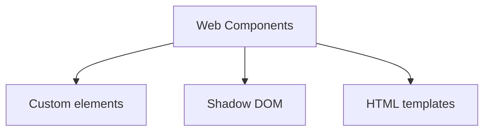

# Gaute snakker om noe frontend greier

---
transition: fade-out
---

<section>
  <div class="obs">OBS!</div>
  <div class="news">
    <div class="content">
      <h2>Nyhetsadvarsel!!!</h2>
      <p><i>Vi er nødt til å avbryte talken med viktige krise nyheter.</i></p>
    </div>
  </div>
  <div class="obs moved">OBS!</div>
</section>

<style>
  section {
    display: flex;
    flex-direction: column;
    height: 100%;
  }

  .obs {
    background-color: red;
    width: fit-content;
    padding: 10px;
    border: 2px dashed yellow;
    font-size: 2rem;
    animation: skew-x-shake 0.5s infinite;
  }

  .obs.moved {
    align-self: flex-end;
  }

  .news {
    flex: 1;
    display: grid;
    place-items: center;
  }

  .news .content {
    background-color: white;
    color: #333;
    padding: 2rem;
    border: 10px dashed red;
  }

  @keyframes skew-x-shake {
    0% { transform: skewX(-15deg); }
    5% { transform: skewX(15deg); }
    10% { transform: skewX(-15deg); }
    15% { transform: skewX(15deg); }
    20% { transform: skewX(0deg); }
    100% { transform: skewX(0deg); }
  }
</style>

---

<div class="scroll">

  <section>
    <logos-react class="text-3xl"/>
    <b>React:</b>
    <p>Jeg er det største rammeverket! (Ups, jeg mente bibliotek).</p>
  </section>

  <section>
    <logos-vue class="text-3xl"/>
    <b>Vue:</b>
    <p>Slapp av da React, mitt økosystem er mer enn stort nok!</p>
  </section>

  <section>
    <logos-solidjs-icon class="text-3xl"/>
    <b>Solid:</b>
    <p>Slutt dere to. Vi MÅ ha signals!!!</p>
  </section>

  <section>
    <logos-vue class="text-3xl"/>
    <b>Vue:</b>
    <p>Vue har hatt signals i flere år før du var født.</p>
  </section>

  <section>
    <logos-svelte-icon class="text-3xl"/>
    <b>Svelte:</b>
    <p>Kompilering gjør Svelte best! Vi har signals med kompileringsmagi.</p>
  </section>

  <section>
    <logos-preact class="text-3xl"/>
    <b>Preact:</b>
    <p>Dere sender så mye unødvendig JavaScript over nettverket, dere er duster!</p>
  </section>
  
  <section>
    <logos-lit-icon class="text-3xl"/>
    <b>Lit:</b>
    <p>Dere må jo bruke webben, har dere hørt om Web Components?!</p>
  </section>

  <section>
    <logos-svelte-icon class="text-3xl"/>
    <b>Svelte:</b>
    <p>Web Components suger!</p>
  </section>

  <section>
    <logos-angular-icon class="text-3xl"/>
    <b>Angular:</b>
    <p><game-icons-nuclear-bomb class="rotate-180 text-8xl"/></p>
  </section>

  <section>
    <logos-react class="text-3xl"/>
    <b>React:</b>
    <p>Sendte du akkurat opp en atombombe!?</p>
  </section>

  <section>
    <logos-angular-icon class="text-3xl"/>
    <b>Angular:</b>
    <p>Ja, drit og dra! Denne kranglingen gidder jeg ikke...</p>
  </section>

  <section>
    <logos-svelte-icon class="text-3xl"/>
    <b>Svelte:</b>
    <p><game-icons-nuclear-bomb class="rotate-180 text-8xl"/></p>
  </section>

  <section>
    <logos-react class="text-3xl"/>
    <b>React:</b>
    <p>Argh!!! Jeg er en stormakt og skal da også sende opp alle mine!</p>
  </section>

  <section>
    <logos-react class="text-3xl"/>
    <b>React:</b>
    <p><game-icons-nuclear-bomb class="rotate-180 text-8xl"/><game-icons-nuclear-bomb class="rotate-90 text-8xl"/><game-icons-nuclear-bomb class="rotate-180 text-8xl"/><game-icons-nuclear-bomb class="rotate-180 text-8xl"/></p>
  </section>
</div>

<style>
  .scroll {
    animation: scroll 70s linear forwards;
  }

  @keyframes scroll {
    0% { translate: 0 450px }
    100% { translate: 0 -900px }
  }

  section {
    display: grid;
    grid-template-columns: auto 1fr;
    column-gap: 5px;
    align-items: center;
    background-color: #e0e0e0;
    color: black;
    border-radius: 15px;
    padding: 10px;
    margin-bottom: 5px;
  }

  section p {
    font-style: italic;
    grid-column: 2;
    margin: 0;
  }

  section b {
    grid-column: 2;
  }

  section svg {
    grid-row: span 2;
  }
</style>

---

<div class="bg"></div>
<p class="text-7xl translate-x-50" style="--time: 0.7s;">💀</p>
<p class="text-7xl translate-x-100 translate-y-100" style="--time: 1.2s;">💀</p>
<p class="text-7xl translate-x-70 translate-y-40" style="--time: 1.5s;">💀</p>
<p class="text-7xl translate-x-10" style="--time: 1s;">💥</p>
<p class="text-7xl translate-x-70" style="--time: 1.2s;">💥</p>
<p class="text-7xl translate-x-120" style="--time: 0.6s;">💥</p>
<p class="text-7xl translate-x-200 translate-y--50" style="--time: 1.9s;">💥</p>
<p class="text-7xl translate-x-20 translate-y-20" style="--time: 2s;">💥</p>
<p class="text-7xl translate-x-170" style="--time: 2.4s;">💥</p>
<p class="text-7xl translate-x-200" style="--time: 1.43s;">😱</p>
<p class="text-7xl translate-y--70" style="--time: 2.5s;">😱</p>
<p class="text-7xl translate-x-130 translate-y--80" style="--time: 1.99s;">☠️</p>
<p class="text-7xl translate-x-180 translate-y--20" style="--time: 1.24s;">☠️</p>
<p class="text-7xl translate-x-185 translate-y--80" style="--time: 1.7s;">☠️</p>

<style>
  .bg {
    position: absolute;
    inset: 0;
    z-index: -1;
    animation: crash 3s infinite alternate;
    opacity: 0.75;
  }

  @keyframes crash {
    0% { background-color: #cc020c; }
    50% { background-color: yellow; }
    100% { background-color: black; }
  }

  p {
    animation: blink var(--time) infinite alternate;
  }

  @keyframes blink {
    0% { opacity: 0; }
    20% { opacity: 0; }
    100% { opacity: 1; }
  }
</style>

---

<div class="grid">
  <game-icons-pirate-grave class="text-8xl"/>
  <game-icons-pirate-grave class="text-8xl"/>
  <game-icons-pirate-grave class="text-8xl"/>
  <game-icons-pirate-grave class="text-8xl"/>
  <game-icons-pirate-grave class="text-8xl"/>
  <game-icons-pirate-grave class="text-8xl"/>
  <game-icons-pirate-grave class="text-8xl"/>
  <game-icons-pirate-grave class="text-8xl"/>
  <game-icons-pirate-grave class="text-8xl"/>
  <game-icons-pirate-grave class="text-8xl"/>
  <game-icons-pirate-grave class="text-8xl"/>
  <game-icons-pirate-grave class="text-8xl"/>
  <game-icons-pirate-grave class="text-8xl"/>
  <game-icons-pirate-grave class="text-8xl"/>
  <game-icons-pirate-grave class="text-8xl"/>
  <game-icons-pirate-grave class="text-8xl"/>
  <game-icons-pirate-grave class="text-8xl"/>
  <game-icons-pirate-grave class="text-8xl"/>
  <game-icons-pirate-grave class="text-8xl"/>
  <game-icons-pirate-grave class="text-8xl"/>
  <game-icons-pirate-grave class="text-8xl"/>
  <game-icons-pirate-grave class="text-8xl"/>
  <game-icons-pirate-grave class="text-8xl"/>
  <game-icons-pirate-grave class="text-8xl"/>
</div>

<logos-react class="text-5xl translate-x-7 translate-y--75 bg-slate-200"/>
<logos-vue class="text-5xl translate-x-137 translate-y--46 bg-slate-200"/>
<logos-preact class="text-5xl translate-x-86 translate-y--105 bg-slate-200"/>
<logos-svelte-icon class="text-5xl translate-x--1 translate-y--45 bg-slate-200"/>
<logos-angular-icon class="text-5xl translate-x-21 translate-y--75 bg-slate-200"/>
<logos-lit-icon class="text-5xl translate-x-7 translate-y--17 bg-slate-200"/>
<logos-solidjs-icon class="text-5xl translate-x-101 translate-y--75 bg-slate-200"/>
<logos-qwik-icon class="text-5xl translate-x-86 translate-y--17 bg-slate-200"/>

<style>
.grid {
  display: grid;
  grid-template-columns: 1fr 1fr 1fr 1fr 1fr 1fr;
}
</style>

---
background: /Capra_Logo_Bakgrunn_01.png
layout: cover
class: text-center
---

# Gaute snakker om noe frontend greier
## Hva nå?

---
background: /Capra_Logo_Bakgrunn_01.png
layout: cover
class: text-center
---

## Capra må lage det nye rammeverket
# 🐐 / GOAT


---
layout: two-cols
---

<Tweet id="1779099983683223872" scale="0.65" />

::right::

<v-clicks>

- Er dette egentlig noe lurt?
- På kun 45 minutter!?

</v-clicks>

---

# Vi trenger en til å lede


---

# Vi trenger en til å lede


---

# Vi trenger en til å lede


---

# Gaute Meek Olsen - CV

<v-clicks>

- Erfaring:
  - Team frontend
  - Vue og React ekspert
  - Kjennskap til de andre alternativene
- Talks:
  - CapraCon 2022 - Hvilket frontend rammeverk liker du?
  - CapraCon 2023 - Kartlegging av web rendering
  - TDC 2023 - Reaktivitet i webrammeverk og hva greia med signals er
  - Kode24-dagen - Sånn gjør du riktig valg av frontendrammeverk i 2024

</v-clicks>

---

# Teamet - dere

- Masse ekspertise
- Meninger

<!-- <Arrow x1="100" y1="200" x2="850" y2="200" v-click="1"/>
<Arrow x1="800" y1="200" x2="100" y2="200" v-click="1"/>

<p class="translate-x-20 translate-y-18" v-click="1">Forståelse</p>
<p class="translate-x-168 translate-y-8" v-click="1">Så lenge det fungerer</p> -->

<div class="translate-y-17" v-click>
  <p>Det dere skal gå hjem med</p>
  <ul>
    <li>Kunnskap om webben</li>
    <li>Inspirasjon</li>
    <li>Påvirke framtiden</li>
  </ul>
</div>

---

<ToDo/>

---
layout: center
---

<p class="text-size-5xl border-solid border-5 border-red-500 p-4 rounded">DISCLAIMER</p>

---

# Components

<Option text="JS abstraksjon" :disabled="true"/>
<Option text="Web Components"/>

---
layout: center
---



---
layout: center
---

# La oss utvikle komponenter 🧑‍💻

---

# Templating style

<div class="grid grid-cols-2">
<Option text="Tag function">

```js
const name = 'Capra'
const render: () => html`<h1>Hi ${name}</h1>`
```

</Option>
<Option text="JSX">

```jsx
const name = 'Capra'
const render: () => <h1>Hi {name}</h1>
```

</Option>
<Option text="SFC">

```html
<template>
  <h1>Hi {name}</h1>
</template>

<script>
const name = 'Capra'
</script>
```

</Option>
</div>

---
layout: center
---

# La oss utvikle bedre templating 🧑‍💻

---

<ToDo/>

---

# Events

<div class="flex flex-col gap-5">

```js
buttonElement.addEventListener('click', () => console.log('🐭'))
```

```js
buttonElement.onclick = () => console.log('🐭')
```

```html
<button onclick="console.log('🐭')">Press me</button>
```

</div>

---
layout: center
---

# La oss utvikle events 🧑‍💻

---

<ToDo/>

---

# Reactivity

|               | Rammeverk                                                                                    |
| ------------- | -------------------------------------------------------------------------------------------- |
| Med signals   | <logos-vue /><logos-solidjs-icon /><logos-preact /><logos-qwik-icon /><logos-angular-icon /> |
| Snart signals | <logos-svelte-icon /><logos-lit-icon />                                                      |
| Uten signals  | <logos-react />                                                                              |

---

# Reactivity

<div class="grid grid-cols-2">
  <Option text="JavaScript Signals standard proposal"/>
  <Option text="Egen signals implementasjon"/>
</div>

---

# Reactivity

<div class="grid grid-cols-2">
  <Option text="Mutable">

  ```js
  const state = signal({ count: 0 })
  state.count++
  ```

  </Option>
  <Option text="Immutable">

  ```js
  const [state, setState] = signal({ count: 0 })
  setState({ count: state().count + 1 })
  ```

  </Option>
</div>

---
layout: center
---

# La oss utvikle reaktivitet med signals 🧑‍💻

---

<ToDo/>

---

# Dynamic DOM


<Toggle :options="['Tag function', 'JSX', 'SFC']"><template #0>

<div class="grid grid-cols-2">
<Option text="JavaScript">

```js
html`
  ${ isVisible ? html`<p>👋</p>` : '' }
`
```

</Option>
<Option text="Dedicated component">

```js
html`<goat-if if="${isVisible}">
  <p>👋</p>
</goat-if>`
```

</Option>
<Option text="Attributes">

```js
html`
  <p if="${isVisible}">👋</p>
`
```

</Option>
</div>

</template>
<template #1>

<div class="grid grid-cols-3">
<Option text="JavaScript">

```jsx
{ isVisible ? <p>👋</p> : '' }
```

</Option>
<Option text="Dedicated component">

```js
<goat-if if={isVisible}>
  <p>👋</p>
</goat-if>
```

</Option>
<Option text="Attributes">

```js
<p if={isVisible}>👋</p>
```

</Option>
</div>

</template>
<template #2>

<div class="grid grid-cols-3">
<Option text="Dedicated component">

```html
<goat-if if="{isVisible}">
  <p>👋</p>
</goat-if>
```

</Option>
<Option text="Attributes">

```html
<p if="{isVisible}">👋</p>
```

</Option>
<Option text="Special syntax">

```html
@if({isVisible}){
  <p>👋</p>
}
```

</Option>
</div>

</template>
</Toggle>

---
layout: center
---

# La oss utvikle conditional rendering 🧑‍💻

---

<ToDo/>

---

# Styling

<div class="grid grid-cols-2">
  <Option text="Global styles only"/>
  <Option text="Scoped styles with shadow DOM"/>
  <Option text="Scoped styles with scoped CSS"/>
</div>

---
layout: center
---

# La oss utvikle scoped css 🧑‍💻

---

<ToDo/>

---
layout: center
---

# La oss utvikle SSG 🧑‍💻

---

<ToDo/>

---
layout: center
---

# La oss utvikle SSR 🧑‍💻

---

<ToDo/>

---


---

# La oss benchmarke litt ⏱️

---
layout: center
---

# TAKK FOR MEG 🥵