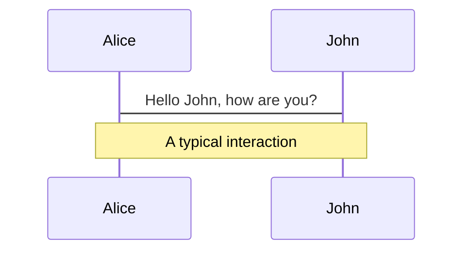
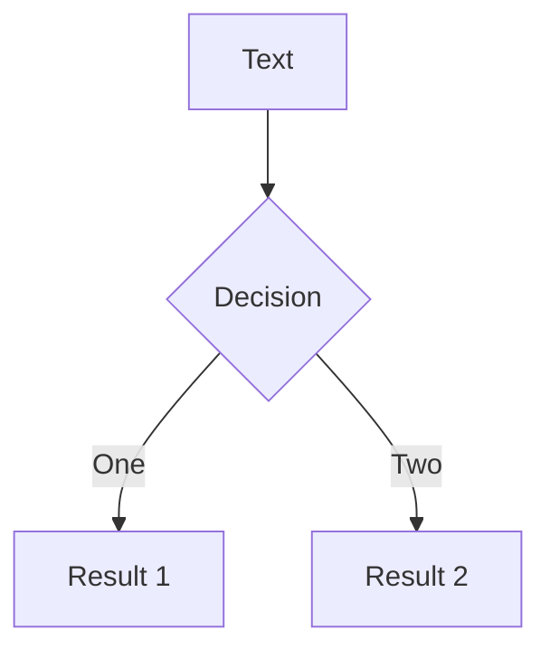
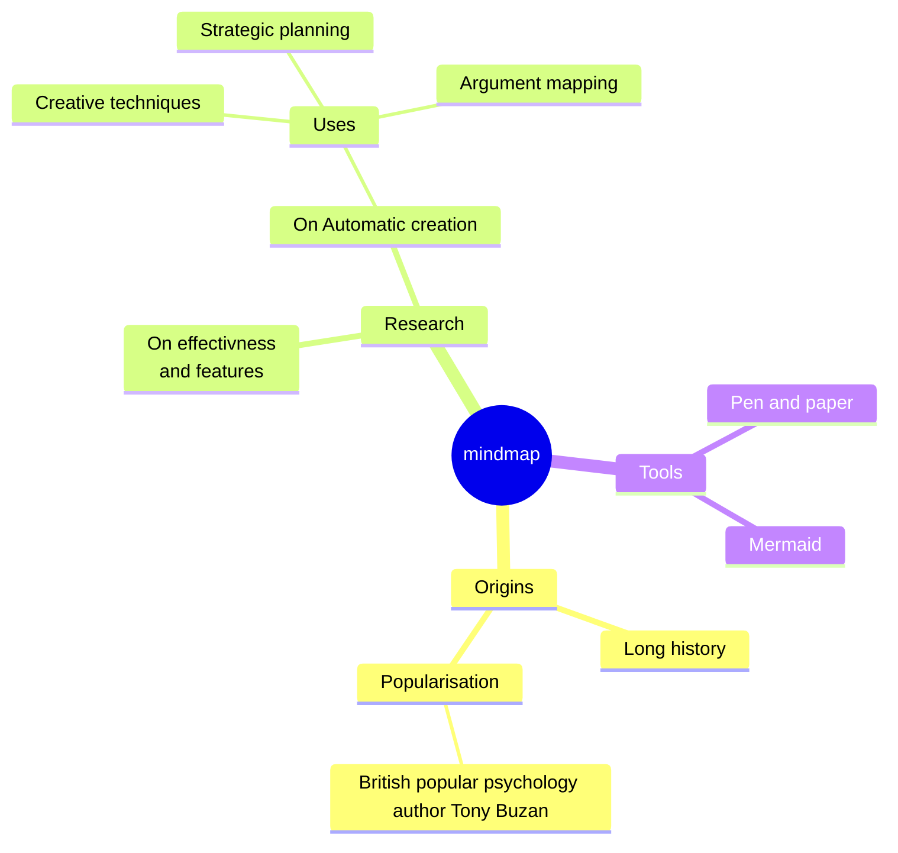
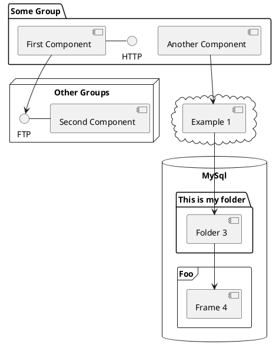

# Gaute snakker om noe frontend greier

---
transition: fade-out
---

<section>
  <div class="obs">OBS!</div>
  <div class="news">
    <div class="content">
      <h2>Nyhetsadvarsel!!!</h2>
      <p><i>Vi er nødt til å avbryte talken med viktige krise nyheter.</i></p>
    </div>
  </div>
  <div class="obs moved">OBS!</div>
</section>

<style>
  section {
    display: flex;
    flex-direction: column;
    height: 100%;
  }

  .obs {
    background-color: red;
    width: fit-content;
    padding: 10px;
    border: 2px dashed yellow;
    font-size: 2rem;
    animation: skew-x-shake 0.5s infinite;
  }

  .obs.moved {
    align-self: flex-end;
  }

  .news {
    flex: 1;
    display: grid;
    place-items: center;
  }

  .news .content {
    background-color: white;
    color: #333;
    padding: 2rem;
    border: 10px dashed red;
  }

  @keyframes skew-x-shake {
    0% { transform: skewX(-15deg); }
    5% { transform: skewX(15deg); }
    10% { transform: skewX(-15deg); }
    15% { transform: skewX(15deg); }
    20% { transform: skewX(0deg); }
    100% { transform: skewX(0deg); }
  }
</style>

---

<div class="scroll">

  <section>
    <logos-react class="text-3xl"/>
    <b>React:</b>
    <p>Jeg er det største rammeverket! (Ups, jeg mente bibliotek).</p>
  </section>

  <section>
    <logos-vue class="text-3xl"/>
    <b>Vue:</b>
    <p>Slapp av da React, mitt økosystem er mer enn stort nok!</p>
  </section>

  <section>
    <logos-solidjs-icon class="text-3xl"/>
    <b>Solid:</b>
    <p>Slutt dere to. Vi MÅ ha signals!!!</p>
  </section>

  <section>
    <logos-vue class="text-3xl"/>
    <b>Vue:</b>
    <p>Vue har hatt signals i flere år før du var født.</p>
  </section>

  <section>
    <logos-svelte-icon class="text-3xl"/>
    <b>Svelte:</b>
    <p>Kompilering gjør Svelte best! Vi har signals med kompileringsmagi.</p>
  </section>

  <section>
    <logos-preact class="text-3xl"/>
    <b>Preact:</b>
    <p>Dere sender så mye unødvendig JavaScript over nettverket, dere er duster!</p>
  </section>
  
  <section>
    <logos-lit-icon class="text-3xl"/>
    <b>Lit:</b>
    <p>Dere må jo bruke webben, har dere hørt om Web Components?!</p>
  </section>

  <section>
    <logos-svelte-icon class="text-3xl"/>
    <b>Svelte:</b>
    <p>Web Components suger!</p>
  </section>

  <section>
    <logos-angular-icon class="text-3xl"/>
    <b>Angular:</b>
    <p><game-icons-nuclear-bomb class="rotate-180 text-8xl"/></p>
  </section>

  <section>
    <logos-react class="text-3xl"/>
    <b>React:</b>
    <p>Sendte du akkurat opp en atombombe!?</p>
  </section>

  <section>
    <logos-angular-icon class="text-3xl"/>
    <b>Angular:</b>
    <p>Ja, drit og dra! Denne kranglingen gidder jeg ikke...</p>
  </section>

  <section>
    <logos-svelte-icon class="text-3xl"/>
    <b>Svelte:</b>
    <p><game-icons-nuclear-bomb class="rotate-180 text-8xl"/></p>
  </section>

  <section>
    <logos-react class="text-3xl"/>
    <b>React:</b>
    <p>Argh!!! Jeg er en stormakt og skal da også sende opp alle mine!</p>
  </section>

  <section>
    <logos-react class="text-3xl"/>
    <b>React:</b>
    <p><game-icons-nuclear-bomb class="rotate-180 text-8xl"/><game-icons-nuclear-bomb class="rotate-90 text-8xl"/><game-icons-nuclear-bomb class="rotate-180 text-8xl"/><game-icons-nuclear-bomb class="rotate-180 text-8xl"/></p>
  </section>
</div>

<style>
  .scroll {
    animation: scroll 70s linear forwards;
  }

  @keyframes scroll {
    0% { translate: 0 450px }
    100% { translate: 0 -900px }
  }

  section {
    display: grid;
    grid-template-columns: auto 1fr;
    column-gap: 5px;
    align-items: center;
    background-color: #e0e0e0;
    color: black;
    border-radius: 15px;
    padding: 10px;
    margin-bottom: 5px;
  }

  section p {
    font-style: italic;
    grid-column: 2;
    margin: 0;
  }

  section b {
    grid-column: 2;
  }

  section svg {
    grid-row: span 2;
  }
</style>

---

<div class="bg"></div>
<p class="text-7xl translate-x-50" style="--time: 0.7s;">💀</p>
<p class="text-7xl translate-x-100 translate-y-100" style="--time: 1.2s;">💀</p>
<p class="text-7xl translate-x-70 translate-y-40" style="--time: 1.5s;">💀</p>
<p class="text-7xl translate-x-10" style="--time: 1s;">💥</p>
<p class="text-7xl translate-x-70" style="--time: 1.2s;">💥</p>
<p class="text-7xl translate-x-120" style="--time: 0.6s;">💥</p>
<p class="text-7xl translate-x-200 translate-y--50" style="--time: 1.9s;">💥</p>
<p class="text-7xl translate-x-20 translate-y-20" style="--time: 2s;">💥</p>
<p class="text-7xl translate-x-170" style="--time: 2.4s;">💥</p>
<p class="text-7xl translate-x-200" style="--time: 1.43s;">😱</p>
<p class="text-7xl translate-y--70" style="--time: 2.5s;">😱</p>
<p class="text-7xl translate-x-130 translate-y--80" style="--time: 1.99s;">☠️</p>
<p class="text-7xl translate-x-180 translate-y--20" style="--time: 1.24s;">☠️</p>
<p class="text-7xl translate-x-185 translate-y--80" style="--time: 1.7s;">☠️</p>

<style>
  .bg {
    position: absolute;
    inset: 0;
    z-index: -1;
    animation: crash 3s infinite alternate;
    opacity: 0.75;
  }

  @keyframes crash {
    0% { background-color: #cc020c; }
    50% { background-color: yellow; }
    100% { background-color: black; }
  }

  p {
    animation: blink var(--time) infinite alternate;
  }

  @keyframes blink {
    0% { opacity: 0; }
    20% { opacity: 0; }
    100% { opacity: 1; }
  }
</style>

---

<div class="grid">
  <game-icons-pirate-grave class="text-8xl"/>
  <game-icons-pirate-grave class="text-8xl"/>
  <game-icons-pirate-grave class="text-8xl"/>
  <game-icons-pirate-grave class="text-8xl"/>
  <game-icons-pirate-grave class="text-8xl"/>
  <game-icons-pirate-grave class="text-8xl"/>
  <game-icons-pirate-grave class="text-8xl"/>
  <game-icons-pirate-grave class="text-8xl"/>
  <game-icons-pirate-grave class="text-8xl"/>
  <game-icons-pirate-grave class="text-8xl"/>
  <game-icons-pirate-grave class="text-8xl"/>
  <game-icons-pirate-grave class="text-8xl"/>
  <game-icons-pirate-grave class="text-8xl"/>
  <game-icons-pirate-grave class="text-8xl"/>
  <game-icons-pirate-grave class="text-8xl"/>
  <game-icons-pirate-grave class="text-8xl"/>
  <game-icons-pirate-grave class="text-8xl"/>
  <game-icons-pirate-grave class="text-8xl"/>
  <game-icons-pirate-grave class="text-8xl"/>
  <game-icons-pirate-grave class="text-8xl"/>
  <game-icons-pirate-grave class="text-8xl"/>
  <game-icons-pirate-grave class="text-8xl"/>
  <game-icons-pirate-grave class="text-8xl"/>
  <game-icons-pirate-grave class="text-8xl"/>
</div>

<logos-react class="text-5xl translate-x-7 translate-y--75 bg-slate-200"/>
<logos-vue class="text-5xl translate-x-137 translate-y--46 bg-slate-200"/>
<logos-preact class="text-5xl translate-x-86 translate-y--105 bg-slate-200"/>
<logos-svelte-icon class="text-5xl translate-x--1 translate-y--45 bg-slate-200"/>
<logos-angular-icon class="text-5xl translate-x-21 translate-y--75 bg-slate-200"/>
<logos-lit-icon class="text-5xl translate-x-7 translate-y--17 bg-slate-200"/>
<logos-solidjs-icon class="text-5xl translate-x-101 translate-y--75 bg-slate-200"/>
<logos-qwik-icon class="text-5xl translate-x-86 translate-y--17 bg-slate-200"/>

<style>
.grid {
  display: grid;
  grid-template-columns: 1fr 1fr 1fr 1fr 1fr 1fr;
}
</style>

---
background: /Capra_Logo_Bakgrunn_01.png
layout: cover
class: text-center
---

# Gaute snakker om noe frontend greier
## Hva nå?

---
background: /Capra_Logo_Bakgrunn_01.png
layout: cover
class: text-center
---

## Capra må lage det nye rammeverket
# 🐐 / GOAT

---

# Gaute Meek Olsen

<v-clicks>

- Erfaring:
  - Team frontend
  - Vue og React ekspert
  - Kjennskap til de andre alternativene
- Talks:
  - CapraCon 2022 - Hvilket frontend rammeverk liker du?
  - CapraCon 2023 - Kartlegging av web rendering
  - TDC 2023 - Reaktivitet i webrammeverk og hva greia med signals er
  - Kode24-dagen - Sånn gjør du riktig valg av frontendrammeverk i 2024

</v-clicks>

---

# Dere

- Masse ekspertise
- Meninger

<Arrow x1="100" y1="200" x2="850" y2="200" v-click="1"/>
<Arrow x1="800" y1="200" x2="100" y2="200" v-click="1"/>

<p class="translate-x-20 translate-y-18" v-click="1">Forståelse</p>
<p class="translate-x-168 translate-y-8" v-click="1">Så lenge det fungerer</p>

<div class="translate-y-17" v-click="2">
  <p>Det dere skal gå hjem med</p>
  <ul>
    <li>Kunnskap om webben</li>
    <li>Inspirasjon</li>
    <li>Påvirke framtiden</li>
  </ul>
</div>

---

# Code

Use code snippets and get the highlighting directly, and even types hover![^1]

```ts {all|5|7|7-8|10|all} twoslash
// TwoSlash enables TypeScript hover information
// and errors in markdown code blocks
// More at https://shiki.style/packages/twoslash

import { computed, ref } from 'vue'

const count = ref(0)
const doubled = computed(() => count.value * 2)

doubled.value = 2
```

<arrow v-click="[4, 5]" x1="350" y1="310" x2="195" y2="334" color="#953" width="2" arrowSize="1" />

<!-- This allow you to embed external code blocks -->
<<< @/snippets/external.ts#snippet

<!-- Footer -->
[^1]: [Learn More](https://sli.dev/guide/syntax.html#line-highlighting)

<!-- Inline style -->
<style>
.footnotes-sep {
  @apply mt-5 opacity-10;
}
.footnotes {
  @apply text-sm opacity-75;
}
.footnote-backref {
  display: none;
}
</style>

<!--
Notes can also sync with clicks

[click] This will be highlighted after the first click

[click] Highlighted with `count = ref(0)`

[click:3] Last click (skip two clicks)
-->

---
level: 2
---

# Shiki Magic Move

Powered by [shiki-magic-move](https://shiki-magic-move.netlify.app/), Slidev supports animations across multiple code snippets.

Add multiple code blocks and wrap them with <code>````md magic-move</code> (four backticks) to enable the magic move. For example:

````md magic-move
```ts {*|2|*}
// step 1
const author = reactive({
  name: 'John Doe',
  books: [
    'Vue 2 - Advanced Guide',
    'Vue 3 - Basic Guide',
    'Vue 4 - The Mystery'
  ]
})
```

```ts {*|1-2|3-4|3-4,8}
// step 2
export default {
  data() {
    return {
      author: {
        name: 'John Doe',
        books: [
          'Vue 2 - Advanced Guide',
          'Vue 3 - Basic Guide',
          'Vue 4 - The Mystery'
        ]
      }
    }
  }
}
```

```ts
// step 3
export default {
  data: () => ({
    author: {
      name: 'John Doe',
      books: [
        'Vue 2 - Advanced Guide',
        'Vue 3 - Basic Guide',
        'Vue 4 - The Mystery'
      ]
    }
  })
}
```

Non-code blocks are ignored.

```vue
<!-- step 4 -->
<script setup>
const author = {
  name: 'John Doe',
  books: [
    'Vue 2 - Advanced Guide',
    'Vue 3 - Basic Guide',
    'Vue 4 - The Mystery'
  ]
}
</script>
```
````

---

# Components

<div grid="~ cols-2 gap-4">
<div>

You can use Vue components directly inside your slides.

We have provided a few built-in components like `<Tweet/>` and `<Youtube/>` that you can use directly. And adding your custom components is also super easy.

```html
<Counter :count="10" />
```

<!-- ./components/Counter.vue -->
<Counter :count="10" m="t-4" />

Check out [the guides](https://sli.dev/builtin/components.html) for more.

</div>
<div>

```html
<Tweet id="1390115482657726468" />
```

<Tweet id="1390115482657726468" scale="0.65" />

</div>
</div>

<!--
Presenter note with **bold**, *italic*, and ~~striked~~ text.

Also, HTML elements are valid:
<div class="flex w-full">
  <span style="flex-grow: 1;">Left content</span>
  <span>Right content</span>
</div>
-->

---
class: px-20
---

# Themes

Slidev comes with powerful theming support. Themes can provide styles, layouts, components, or even configurations for tools. Switching between themes by just **one edit** in your frontmatter:

<div grid="~ cols-2 gap-2" m="t-2">

```yaml
---
theme: default
---
```

```yaml
---
theme: seriph
---
```


</div>

Read more about [How to use a theme](https://sli.dev/themes/use.html) and
check out the [Awesome Themes Gallery](https://sli.dev/themes/gallery.html).

---

# Clicks Animations

You can add `v-click` to elements to add a click animation.

<div v-click>

This shows up when you click the slide:

```html
<div v-click>This shows up when you click the slide.</div>
```

</div>

<br>

<v-click>

The <span v-mark.red="3"><code>v-mark</code> directive</span>
also allows you to add
<span v-mark.circle.orange="4">inline marks</span>
, powered by [Rough Notation](https://roughnotation.com/):

```html
<span v-mark.underline.orange>inline markers</span>
```

</v-click>

<div mt-20 v-click>

[Learn More](https://sli.dev/guide/animations#click-animations)

</div>

---
preload: false
---

# Motions

Motion animations are powered by [@vueuse/motion](https://motion.vueuse.org/), triggered by `v-motion` directive.

```html
<div
  v-motion
  :initial="{ x: -80 }"
  :enter="{ x: 0 }">
  Slidev
</div>
```

<div class="w-60 relative mt-6">
  <div class="relative w-40 h-40">
    
    
    
  </div>

  <div
    class="text-5xl absolute top-14 left-40 text-[#2B90B6] -z-1"
    v-motion
    :initial="{ x: -80, opacity: 0}"
    :enter="{ x: 0, opacity: 1, transition: { delay: 2000, duration: 1000 } }">
    Slidev
  </div>
</div>

<!-- vue script setup scripts can be directly used in markdown, and will only affects current page -->
<script setup lang="ts">
const final = {
  x: 0,
  y: 0,
  rotate: 0,
  scale: 1,
  transition: {
    type: 'spring',
    damping: 10,
    stiffness: 20,
    mass: 2
  }
}
</script>

<div
  v-motion
  :initial="{ x:35, y: 40, opacity: 0}"
  :enter="{ y: 0, opacity: 1, transition: { delay: 3500 } }">

[Learn More](https://sli.dev/guide/animations.html#motion)

</div>

---

# LaTeX

LaTeX is supported out-of-box powered by [KaTeX](https://katex.org/).

<br>

Inline $\sqrt{3x-1}+(1+x)^2$

Block
$$ {1|3|all}
\begin{array}{c}

\nabla \times \vec{\mathbf{B}} -\, \frac1c\, \frac{\partial\vec{\mathbf{E}}}{\partial t} &
= \frac{4\pi}{c}\vec{\mathbf{j}}    \nabla \cdot \vec{\mathbf{E}} & = 4 \pi \rho \\

\nabla \times \vec{\mathbf{E}}\, +\, \frac1c\, \frac{\partial\vec{\mathbf{B}}}{\partial t} & = \vec{\mathbf{0}} \\

\nabla \cdot \vec{\mathbf{B}} & = 0

\end{array}
$$

<br>

[Learn more](https://sli.dev/guide/syntax#latex)

---

# Diagrams

You can create diagrams / graphs from textual descriptions, directly in your Markdown.

<div class="grid grid-cols-4 gap-5 pt-4 -mb-6">









</div>

[Learn More](https://sli.dev/guide/syntax.html#diagrams)

---
src: ./pages/multiple-entries.md
hide: false
---

---

# Monaco Editor

Slidev provides built-in Moanco Editor support.

Add `{monaco}` to the code block to turn it into an editor:

```ts {monaco}
import { ref } from 'vue'
import hello from './external'

const code = ref('const a = 1')
hello()
```

Use `{monaco-run}` to create an editor that can execute the code directly in the slide:

```ts {monaco-run}
function fibonacci(n: number): number {
  return n <= 1
    ? n
    : fibonacci(n - 1) + fibonacci(n - 2) // you know, this is NOT the best way to do it :P
}

console.log(Array.from({ length: 10 }, (_, i) => fibonacci(i + 1)))
```

---
layout: center
class: text-center
---

# Learn More

[Documentations](https://sli.dev) · [GitHub](https://github.com/slidevjs/slidev) · [Showcases](https://sli.dev/showcases.html)
