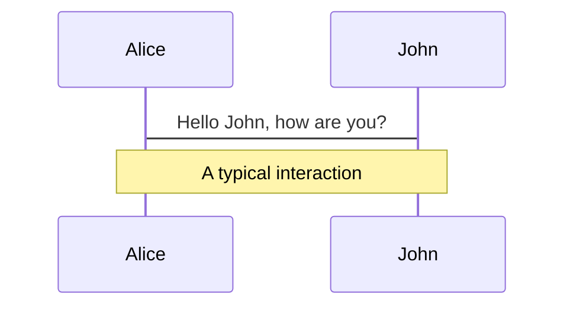
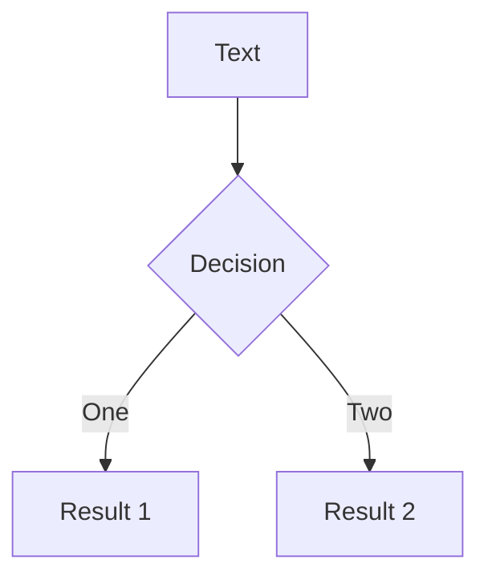
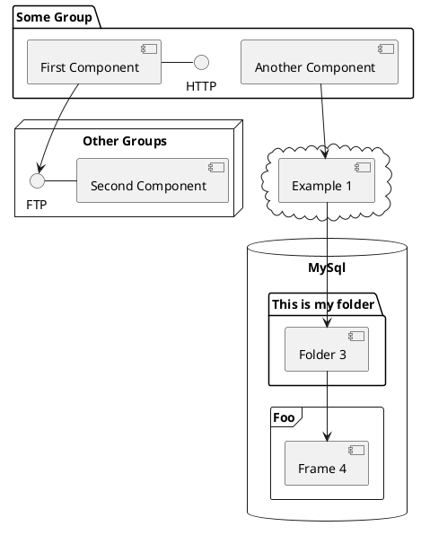

<section>
  <h1>Kartlegging av web rendering</h1>
  <h2>
    Av
    <a href="https://gaute.dev" target="_blank" rel="noopener noreferrer">Gaute Meek Olsen</a>
  </h2>
  
</section>

<style scoped>
section {
  height: 100%;
  display: grid;
  grid-template-rows: auto auto 1fr;
  justify-items: center;
}

h1 {
  text-align: center;
  padding-top: 1em;
  font-size: 2.5em;
  text-shadow: 2px 2px #F6416C;
}

img {
  border-radius: 50%;
}
</style>

---

<section>
  <h2>Men nå har det blitt så mange begreper</h2>
  <ul>
    <li>SPA</li>
    <li>MPA</li>
    <li>SSG</li>
    <li>SSR</li>
    <li>CSR</li>
    <li>Hydration</li>
    <li>Resumability</li>
    <li>Islands</li>
    <li>Progressive enhancement</li>
    <li>Partial hydration</li>
    <li>Edge rendering</li>
    <li>...</li>
  </ul>
</section>

<style>
section {
  display: grid;
  grid-template-rows: auto 1fr;
}

ul {
  list-style: none !important;
  margin: 0;
  padding: 2em;
  font-size: 1.3em;
  display: grid;
  grid-template: 1fr 1fr 1fr 1fr / 1fr 1fr 1fr;
  text-align: center;
}

li {
  margin: 0 !important;
  padding: 0 !important;
}
</style>

---

Eksempel - handleliste

<Handlekurv :static="true" :preffilled="true"/>

---

Eksempel - handleliste

<Handlekurv :preffilled="true"/>

---

<Screen>

```html
<form>
  <label for="add">Legg til</label>
  <input type="text" id="add">
  <button>Lagre</button>
</form>
<ul>
  <li></li>
</ul>
```

</Screen>

---

<DemoRender :step="5" :working="true">
<Screen>

```html
<form>
  <label for="add">Legg til</label>
  <input type="text" id="add">
  <button>Lagre</button>
</form>
<ul>
  <li></li>
</ul>
```

</Screen>
</DemoRender>

---

# Components

<div grid="~ cols-2 gap-4">
<div>

You can use Vue components directly inside your slides.

We have provided a few built-in components like `<Tweet/>` and `<Youtube/>` that you can use directly. And adding your custom components is also super easy.

```html
<Counter :count="10" />
```

<!-- ./components/Counter.vue -->
<Counter :count="10" m="t-4" />

Check out [the guides](https://sli.dev/builtin/components.html) for more.

</div>
<div>

```html
<Tweet id="1390115482657726468" />
```

<Tweet id="1390115482657726468" scale="0.65" />

</div>
</div>

<!--
Presenter note with **bold**, *italic*, and ~~striked~~ text.

Also, HTML elements are valid:
<div class="flex w-full">
  <span style="flex-grow: 1;">Left content</span>
  <span>Right content</span>
</div>
-->


---
class: px-20
---

# Themes

Slidev comes with powerful theming support. Themes can provide styles, layouts, components, or even configurations for tools. Switching between themes by just **one edit** in your frontmatter:

<div grid="~ cols-2 gap-2" m="-t-2">

```yaml
---
theme: default
---
```

```yaml
---
theme: seriph
---
```


</div>

Read more about [How to use a theme](https://sli.dev/themes/use.html) and
check out the [Awesome Themes Gallery](https://sli.dev/themes/gallery.html).

---
preload: false
---

# Animations

Animations are powered by [@vueuse/motion](https://motion.vueuse.org/).

```html
<div
  v-motion
  :initial="{ x: -80 }"
  :enter="{ x: 0 }">
  Slidev
</div>
```

<div class="w-60 relative mt-6">
  <div class="relative w-40 h-40">
    
    
    
  </div>

  <div
    class="text-5xl absolute top-14 left-40 text-[#2B90B6] -z-1"
    v-motion
    :initial="{ x: -80, opacity: 0}"
    :enter="{ x: 0, opacity: 1, transition: { delay: 2000, duration: 1000 } }">
    Slidev
  </div>
</div>

<!-- vue script setup scripts can be directly used in markdown, and will only affects current page -->
<script setup lang="ts">
const final = {
  x: 0,
  y: 0,
  rotate: 0,
  scale: 1,
  transition: {
    type: 'spring',
    damping: 10,
    stiffness: 20,
    mass: 2
  }
}
</script>

<div
  v-motion
  :initial="{ x:35, y: 40, opacity: 0}"
  :enter="{ y: 0, opacity: 1, transition: { delay: 3500 } }">

[Learn More](https://sli.dev/guide/animations.html#motion)

</div>

---

# LaTeX

LaTeX is supported out-of-box powered by [KaTeX](https://katex.org/).

<br>

Inline $\sqrt{3x-1}+(1+x)^2$

Block
$$
\begin{array}{c}

\nabla \times \vec{\mathbf{B}} -\, \frac1c\, \frac{\partial\vec{\mathbf{E}}}{\partial t} &
= \frac{4\pi}{c}\vec{\mathbf{j}}    \nabla \cdot \vec{\mathbf{E}} & = 4 \pi \rho \\

\nabla \times \vec{\mathbf{E}}\, +\, \frac1c\, \frac{\partial\vec{\mathbf{B}}}{\partial t} & = \vec{\mathbf{0}} \\

\nabla \cdot \vec{\mathbf{B}} & = 0

\end{array}
$$

<br>

[Learn more](https://sli.dev/guide/syntax#latex)

---

# Diagrams

You can create diagrams / graphs from textual descriptions, directly in your Markdown.

<div class="grid grid-cols-3 gap-10 pt-4 -mb-6">







</div>

[Learn More](https://sli.dev/guide/syntax.html#diagrams)

---
src: ./pages/multiple-entries.md
hide: false
---

---
layout: center
class: text-center
---

# Learn More

[Documentations](https://sli.dev) · [GitHub](https://github.com/slidevjs/slidev) · [Showcases](https://sli.dev/showcases.html)
