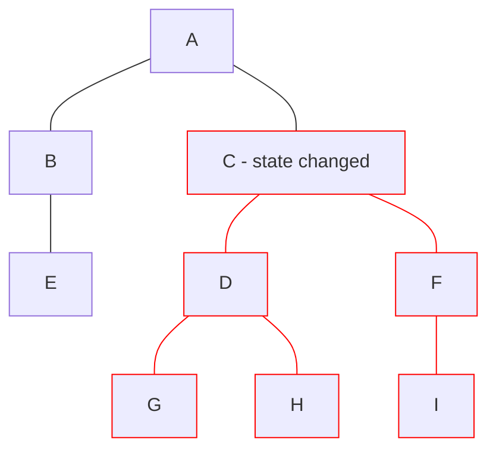

# Angular

- Signals 2023, v16

<logos-angular-icon class="text-9xl scale-200 translate-x-3em translate-y-60px" />

---
transition: fade
---

# Angular reactivity
 
```js
import { Component } from '@angular/core'

@Component({
  selector: 'count-component',
  templateUrl: './count.component.html',
})
export class CountComponent {
  increase() {
  }
}
```

---
transition: fade
---

# Angular reactivity
 
```js {1,8,11}
import { Component, signal } from '@angular/core'

@Component({
  selector: 'count-component',
  templateUrl: './count.component.html',
})
export class CountComponent {
  count = signal(0)

  increase() {
    this.count.set(this.count() + 1)
  }
}
```

---
transition: fade
---

# Angular reactivity
 
```js {1,9}
import { Component, signal, computed } from '@angular/core'

@Component({
  selector: 'count-component',
  templateUrl: './count.component.html',
})
export class CountComponent {
  count = signal(0)
  double = computed(() => this.count() * 2)

  increase() {
    this.count.set(this.count() + 1)
  }
}
```

---
transition: fade
---

# Angular reactivity
 
```js {1,11-13}
import { Component, signal, computed, effect } from '@angular/core'

@Component({
  selector: 'count-component',
  templateUrl: './count.component.html',
})
export class CountComponent {
  count = signal(0)
  double = computed(() => this.count() * 2)

  constructor() {
    effect(() => console.log(this.double()))
  }

  increase() {
    this.count.set(this.count() + 1)
  }
}
```

---
transition: fade
---

# Angular reactivity
 
```js {16-18}
import { Component, signal, computed, effect } from '@angular/core'

@Component({
  selector: 'count-component',
  templateUrl: './count.component.html',
})
export class CountComponent {
  count = signal(0)
  double = computed(() => this.count() * 2)

  constructor() {
    effect(() => console.log(this.double()))
  }

  increase() {
    this.count.set(this.count() + 1)
    console.log(this.count()) // 1
    console.log(this.double()) // 2
  }
}
```

---

# Angular reactivity
 
```js {3,4,11-15}
import { Component, signal, computed, effect } from '@angular/core'

const count = signal(0)
const double = computed(() => count() * 2)

@Component({
  selector: 'count-component',
  templateUrl: './count.component.html',
})
export class CountComponent {
  count = count
  double = double
  constructor() {
    effect(() => console.log(double()))
  }

  increase() {
    count.set(count() + 1)
  }
}
```

---
layout: center
---

# Angular re-render



---

# Angular summary

|                                            | <logos-angular-icon class="text-5xl"/>                                |
| ------------------------------------------ | --------------------------------------------------------------------- |
| mutable vs immutable API                   | <span v-click>Immutable</span>                                        |
| State is always in sync                    | <emojione-white-heavy-check-mark v-click class="text-2xl"/>           |
| Re-render                                  | <noto-deciduous-tree v-click class="text-2xl"/>                       |
| Works outside the component                | <span v-click><openmoji-palm-down-hand class="text-2xl"/>(2/3)</span> |
| Works outside the framework                | <span v-click><openmoji-palm-down-hand class="text-2xl"/>(2/3)</span> |

<!--
effect() can only be used within an injection context
-->