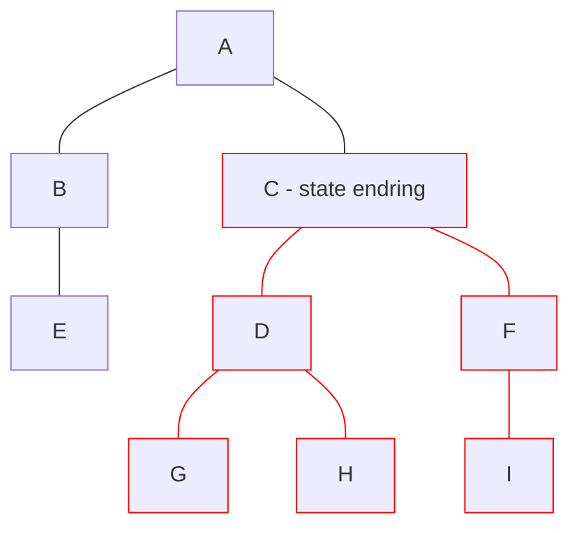

# Angular

- Signals 2023, v16

<logos-angular-icon class="text-9xl scale-200 translate-x-3em translate-y-60px" />

---

# Angular reaktivitet
 
```js {monaco}
import { Component, signal, computed, effect } from '@angular/core'

@Component({
  selector: 'count-component',
  templateUrl: './count.component.html',
})
export class CountComponent {
  count = signal(0)

  increase() {
    count.set(this.count() + 1)
  }
}
```
<Copy framework="angular"/>

---
layout: center
---

# Angular re-render



---

# Angular oppsummering

|                                            | <logos-angular-icon class="text-5xl"/>                                |
| ------------------------------------------ | --------------------------------------------------------------------- |
| mutable vs immutable API                   | <span v-click>Immutable</span>                                        |
| Ummidelbar oppdatering                     | <emojione-white-heavy-check-mark v-click class="text-2xl"/>           |
| Re-render                                  | <noto-deciduous-tree v-click class="text-2xl"/>                       |
| Fungerer utenfor komponenten               | <span v-click><openmoji-palm-down-hand class="text-2xl"/>(2/3)</span> |
| Fungerer utenfor rammeverk                 | <span v-click><openmoji-palm-down-hand class="text-2xl"/>(2/3)</span> |

<!--
effect() can only be used within an injection context
-->