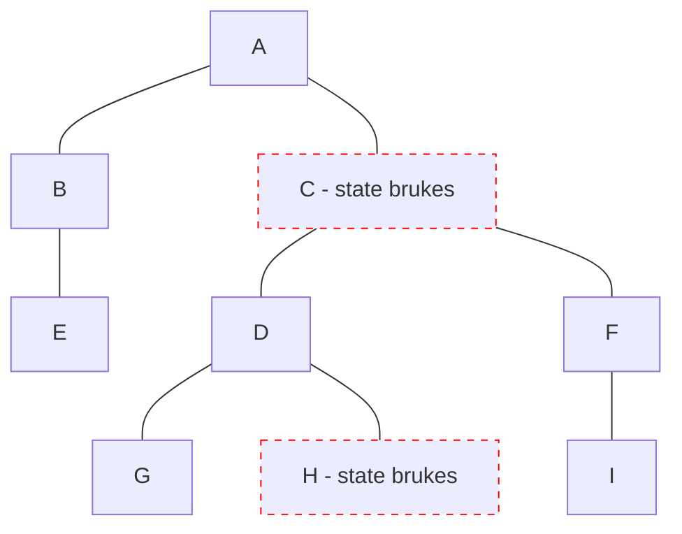

# Preact

- Signals 2022, @preact/signals

<logos-preact class="text-9xl scale-200 translate-x-3em translate-y-60px" />

---

# Preact reaktivitet
 
```jsx {monaco}
import { signal } from '@preact/signals'

export function Component() {
  const count = signal(0)
  function increase() {
    count.value++
  }

  return (
    <>
      <p>Count: { count }</p>
      <button onClick={increase}>Bump</button>
    </>
  )
}
```

---
layout: center
---

# Preact re-render



---

# Preact oppsummering

|                                            | <logos-preact class="text-5xl"/>                        |
| ------------------------------------------ | ------------------------------------------------------------- |
| mutable vs immutable API                   |  <span v-click>Mutable</span>                               |
| Ummidelbar oppdatering                     |  <emojione-white-heavy-check-mark v-click class="text-2xl"/>  |
| Re-render                                  |  <material-symbols-jump-to-element v-click class="text-3xl"/> |
| Fungerer utenfor komponenten               |  <emojione-white-heavy-check-mark v-click class="text-2xl"/>  |
| Fungerer utenfor rammeverk                 |  <emojione-white-heavy-check-mark v-click class="text-2xl"/>  |