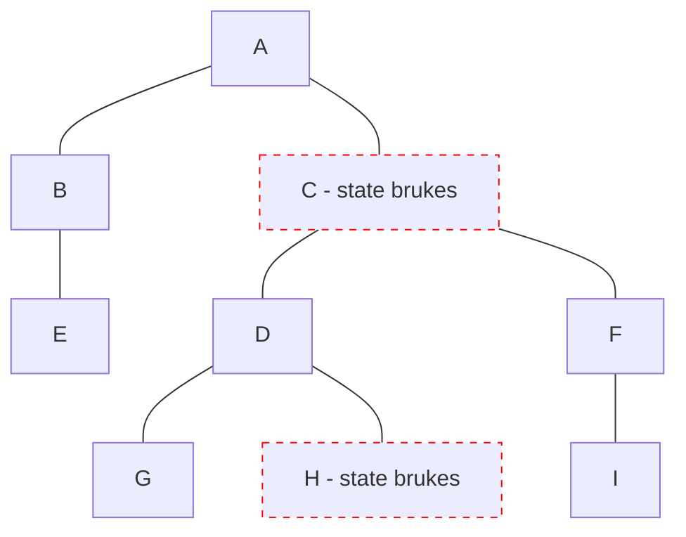

# Preact

- Signals 2022, @preact/signals

<logos-preact class="text-9xl scale-200 translate-x-3em translate-y-60px" />

---
transition: fade
---

# Preact reaktivitet
 
```jsx
export function Component() {
  function increase() {
  }

  return (
    <>
      <p>Count: 0</p>
      <button onClick={increase}>Bump</button>
    </>
  )
}
```

---
transition: fade
---

# Preact reaktivitet
 
```jsx {1,4,6,11}
import { signal } from '@preact/signals'

export function Component() {
  const count = signal(0)
  function increase() {
    count.value++
  }

  return (
    <>
      <p>Count: {count}</p>
      <button onClick={increase}>Bump</button>
    </>
  )
}
```

---
transition: fade
---

# Preact reaktivitet
 
```jsx {1,5}
import { signal, computed } from '@preact/signals'

export function Component() {
  const count = signal(0)
  const double = computed(() => count.value * 2)
  function increase() {
    count.value++
  }

  return (
    <>
      <p>Count: {count}</p>
      <button onClick={increase}>Bump</button>
    </>
  )
}
```

---
transition: fade
---

# Preact reaktivitet
 
```jsx {1,6}
import { signal, computed, effect } from '@preact/signals'

export function Component() {
  const count = signal(0)
  const double = computed(() => count.value * 2)
  effect(() => console.log(double.value))
  function increase() {
    count.value++
  }

  return (
    <>
      <p>Count: {count}</p>
      <button onClick={increase}>Bump</button>
    </>
  )
}
```

---
transition: fade
---

# Preact reaktivitet
 
```jsx {8,9,10}
import { signal, computed, effect } from '@preact/signals'

export function Component() {
  const count = signal(0)
  const double = computed(() => count.value * 2)
  effect(() => console.log(double.value))
  function increase() {
    count.value++
    console.log(count.value) // 1
    console.log(double.value) // 2
  }

  return (
    <>
      <p>Count: {count}</p>
      <button onClick={increase}>Bump</button>
    </>
  )
}
```

---

# Preact reaktivitet
 
```jsx {3-8}
import { signal, computed, effect } from '@preact/signals'

const count = signal(0)
const double = computed(() => count.value * 2)
effect(() => console.log(double.value))
function increase() {
  count.value++
}

export function Component() {
  return (
    <>
      <p>Count: {count}</p>
      <button onClick={increase}>Bump</button>
    </>
  )
}
```

---
layout: center
---

# Preact re-render



---

# Preact oppsummering

|                                            | <logos-preact class="text-5xl"/>                             |
| ------------------------------------------ | ------------------------------------------------------------ |
| mutable vs immutable API                   | <span v-click>Mutable</span>                                 |
| State er alltid i sync                     | <emojione-white-heavy-check-mark v-click class="text-2xl"/>  |
| Re-render                                  | <material-symbols-jump-to-element v-click class="text-3xl"/> |
| Fungerer utenfor komponenten               | <emojione-white-heavy-check-mark v-click class="text-2xl"/>  |
| Fungerer utenfor rammeverk                 | <emojione-white-heavy-check-mark v-click class="text-2xl"/>  |