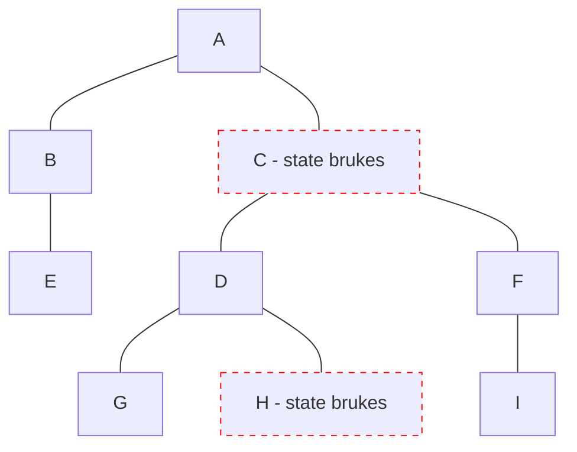

# Qwik

- Signals 2023, v1

<logos-qwik-icon class="text-9xl scale-200 translate-x-3em translate-y-60px" />

---
transition: fade
---

# Qwik reaktivitet

```jsx
import { component$, useSignal, useComputed$, $ } from '@builder.io/qwik'

export default component$(() => {
  const count = useSignal(0)
  const double = useComputed$(() => count.value * 2)
  const increase = $(() => {
    count.value++
  })

  return (
    <>
      <p>Count: { count.value }</p>
      <button onClick$={increase}>Bump</button>
    </>
  )
})
```

---
transition: fade
---

# Qwik reaktivitet

```jsx {1,6-9}
import { component$, useSignal, useComputed$, $, useTask$ } from '@builder.io/qwik'

export default component$(() => {
  const count = useSignal(0)
  const double = useComputed$(() => count.value * 2)
  useTask$(({track}) => {
    track(() => double.value)
    console.log(double.value)
  })
  const increase = $(() => {
    count.value++
  })

  return (
    <>
      <p>Count: { count.value }</p>
      <button onClick$={increase}>Bump</button>
    </>
  )
})
```

---
transition: fade
---

# Qwik reaktivitet

```jsx {11-13}
import { component$, useSignal, useComputed$, $, useTask$ } from '@builder.io/qwik'

export default component$(() => {
  const count = useSignal(0)
  const double = useComputed$(() => count.value * 2)
  useTask$(({track}) => {
    track(() => double.value)
    console.log(double.value)
  })
  const increase = $(() => {
    count.value++
    console.log(count.value) // 1
    console.log(double.value) // 0
  })

  return (
    <>
      <p>Count: { count.value }</p>
      <button onClick$={increase}>Bump</button>
    </>
  )
})
```

---

# Qwik reaktivitet

```jsx {3}
import { component$, useSignal, useComputed$, $, useTask$ } from '@builder.io/qwik'

const count = useSignal(0) // ❌

export default component$(() => {
  const double = useComputed$(() => count.value * 2)
  useTask$(({track}) => {
    track(() => double.value)
    console.log(double.value)
  })
  const increase = $(() => {
    count.value++
  })

  return (
    <>
      <p>Count: { count.value }</p>
      <button onClick$={increase}>Bump</button>
    </>
  )
})
```

---
layout: center
---

# Qwik re-render



---

# Qwik oppsummering

|                                            | <logos-qwik-icon class="text-5xl"/>                          |
| ------------------------------------------ | ------------------------------------------------------------ |
| mutable vs immutable API                   | <span v-click>Mutable</span>                                 |
| State er alltid i sync                     | <emojione-cross-mark-button v-click class="text-2xl"/>       |
| Re-render                                  | <material-symbols-jump-to-element v-click class="text-3xl"/> |
| Fungerer utenfor komponenten               | <emojione-cross-mark-button v-click class="text-2xl"/>       |
| Fungerer utenfor rammeverk                 | <emojione-cross-mark-button v-click class="text-2xl"/>       |

<!--
Calling a 'use*()' method outside 'component$(() => { HERE })' is not allowed.
-->