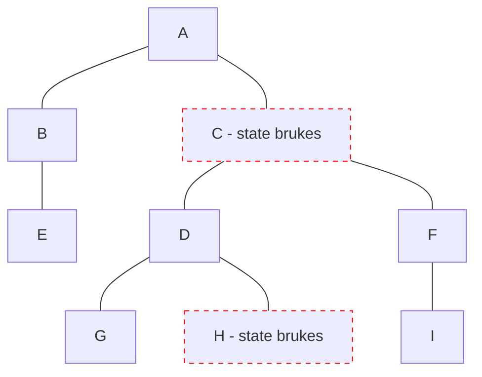

# Qwik

- Signals 2023, v1

<logos-qwik-icon class="text-9xl scale-200 translate-x-3em translate-y-60px" />

---

# Qwik reaktivitet

```jsx {monaco}
import { component$, useSignal } from '@builder.io/qwik'

export default component$(() => {
  const count = useSignal(0)
  function increase() {
    count.value++
  }

  return (
    <>
      <p>Count: { count.value }</p>
      <button onClick$={increase}>Bump</button>
    </>
  )
})
```

---
layout: center
---

# Qwik re-render



---

# Qwik oppsummering

|                                            | <logos-qwik-icon class="text-5xl"/>                           |
| ------------------------------------------ | ------------------------------------------------------------- |
| mutable vs immutable API                   |  <span v-click>Mutable</span>                                 |
| Ummidelbar oppdatering                     |  <emojione-cross-mark-button v-click class="text-2xl"/>       |
| Re-render                                  |  <material-symbols-jump-to-element v-click class="text-3xl"/> |
| Fungerer utenfor komponenten               |  <emojione-cross-mark-button v-click class="text-2xl"/>       |
| Fungerer utenfor rammeverk                 |  <emojione-cross-mark-button v-click class="text-2xl"/>       |

<!--
Calling a 'use*()' method outside 'component$(() => { HERE })' is not allowed.
-->