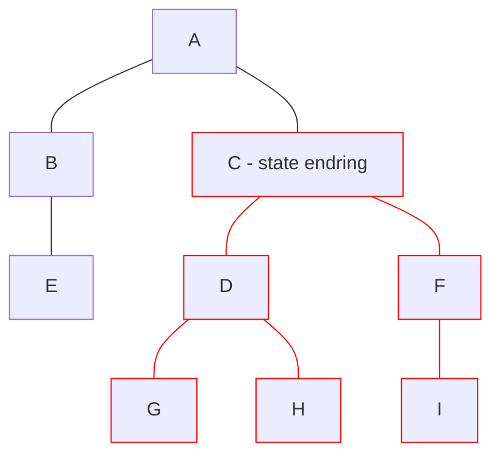

# React

- Hooks 2019, v16.8

<logos-react class="text-9xl scale-200 translate-x-3em translate-y-60px" />

---

# React reaktivitet

```jsx {monaco}
import { useState, useMemo, useEffect } from 'react'

export function Component() {
  const [count, setCount] = useState(0)
  function increase() {
    setCount(count + 1)
  }

  return (
    <>
      <p>Count: { count }</p>
      <button onClick={increase}>Bump</button>
    </>
  )
}
```
<Copy framework="react"/>

---
layout: center
---

# React re-render



---

# React oppsummering

|                                            | <logos-react class="text-5xl"/>                          |
| ------------------------------------------ | -------------------------------------------------------- |
| mutable vs immutable API                   |  <span v-click>Immutable</span>                          |
| Ummidelbar oppdatering                     |  <emojione-cross-mark-button v-click class="text-2xl"/>  |
| Re-render                                  |  <noto-deciduous-tree v-click class="text-2xl"/>         |
| Fungerer utenfor komponenten               |  <emojione-cross-mark-button v-click class="text-2xl"/>  |
| Fungerer utenfor rammeverk                 |  <emojione-cross-mark-button v-click class="text-2xl"/>  |
