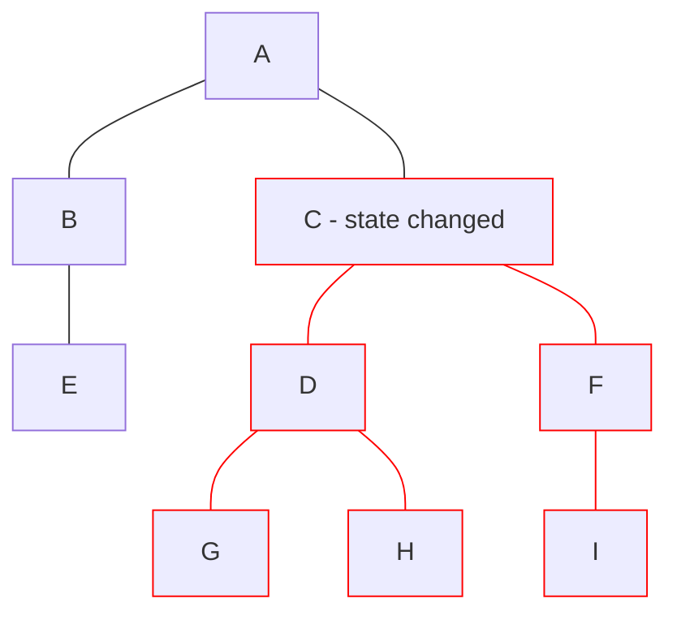

# React

- Hooks 2019, v16.8

<logos-react class="text-9xl scale-200 translate-x-3em translate-y-60px" />

---
transition: fade
---

# React reactivity

```jsx
export function Component() {
  function increase() {
  }

  return (
    <>
      <p>Count: 0</p>
      <button onClick={increase}>Bump</button>
    </>
  )
}
```

---
transition: fade
---

# React reactivity

```jsx {1,4,6,11}
import { useState } from 'react'

export function Component() {
  const [count, setCount] = useState(0)
  function increase() {
    setCount(count + 1)
  }

  return (
    <>
      <p>Count: {count}</p>
      <button onClick={increase}>Bump</button>
    </>
  )
}
```

---
transition: fade
---

# React reactivity

```jsx {5}
import { useState } from 'react'

export function Component() {
  const [count, setCount] = useState(0)
  const double = count * 2
  function increase() {
    setCount(count + 1)
  }

  return (
    <>
      <p>Count: {count}</p>
      <button onClick={increase}>Bump</button>
    </>
  )
}
```

---
transition: fade
---

# React reactivity

```jsx {5}
import { useState, useMemo } from 'react'

export function Component() {
  const [count, setCount] = useState(0)
  const double = useMemo(() => count * 2, [count])
  function increase() {
    setCount(count + 1)
  }

  return (
    <>
      <p>Count: {count}</p>
      <button onClick={increase}>Bump</button>
    </>
  )
}
```

---
transition: fade
---

# React reactivity

```jsx {5}
import { useState } from 'react'

export function Component() {
  const [count, setCount] = useState(0)
  const double = count * 2
  function increase() {
    setCount(count + 1)
  }

  return (
    <>
      <p>Count: {count}</p>
      <button onClick={increase}>Bump</button>
    </>
  )
}
```

---
transition: fade
---

# React reactivity

```jsx {6}
import { useState, useEffect } from 'react'

export function Component() {
  const [count, setCount] = useState(0)
  const double = count * 2
  useEffect(() => console.log(double), [double])
  function increase() {
    setCount(count + 1)
  }

  return (
    <>
      <p>Count: {count}</p>
      <button onClick={increase}>Bump</button>
    </>
  )
}
```

---
transition: fade
---

# React reactivity

```jsx {8,9,10}
import { useState, useEffect } from 'react'

export function Component() {
  const [count, setCount] = useState(0)
  const double = count * 2
  useEffect(() => console.log(double), [double])
  function increase() {
    setCount(count + 1)
    console.log(count) // 0
    console.log(double) // 0
  }

  return (
    <>
      <p>Count: { count }</p>
      <button onClick={increase}>Bump</button>
    </>
  )
}
```

---

# React reactivity

```jsx {3}
import { useState, useEffect } from 'react'

const [count, setCount] = useState(0) // ❌

export function Component() {
  const double = count * 2
  useEffect(() => console.log(double), [double])
  function increase() {
    setCount(count + 1)
    console.log(count) // 0
    console.log(double) // 0
  }

  return (
    <>
      <p>Count: { count }</p>
      <button onClick={increase}>Bump</button>
    </>
  )
}
```

---
layout: center
---

# React re-render



---

# React summary

|                                            | <logos-react class="text-5xl"/>                          |
| ------------------------------------------ | -------------------------------------------------------- |
| mutable vs immutable API                   |  <span v-click>Immutable</span>                          |
| State is always in sync                    |  <emojione-cross-mark-button v-click class="text-2xl"/>  |
| Re-render                                  |  <noto-deciduous-tree v-click class="text-2xl"/>         |
| Works outside the component                |  <emojione-cross-mark-button v-click class="text-2xl"/>  |
| Works outside the framework                |  <emojione-cross-mark-button v-click class="text-2xl"/>  |
