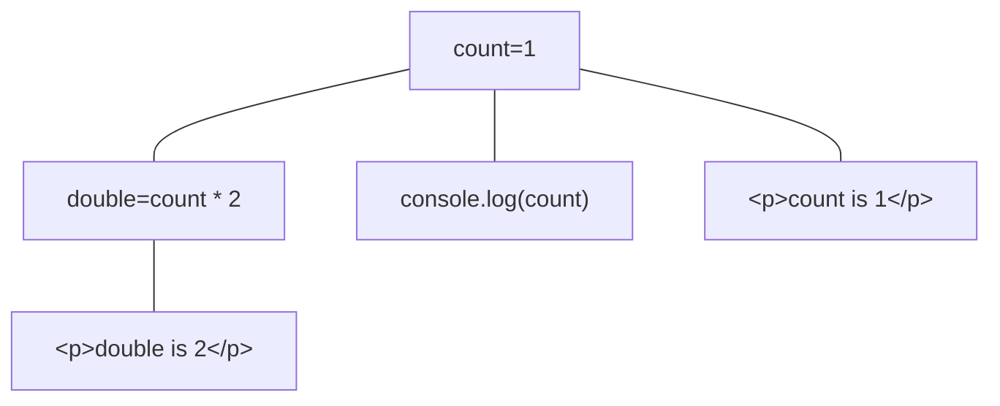
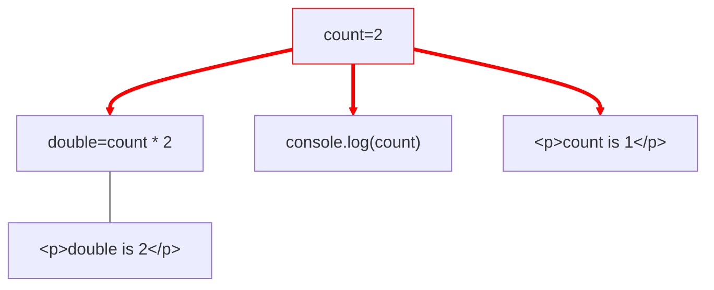
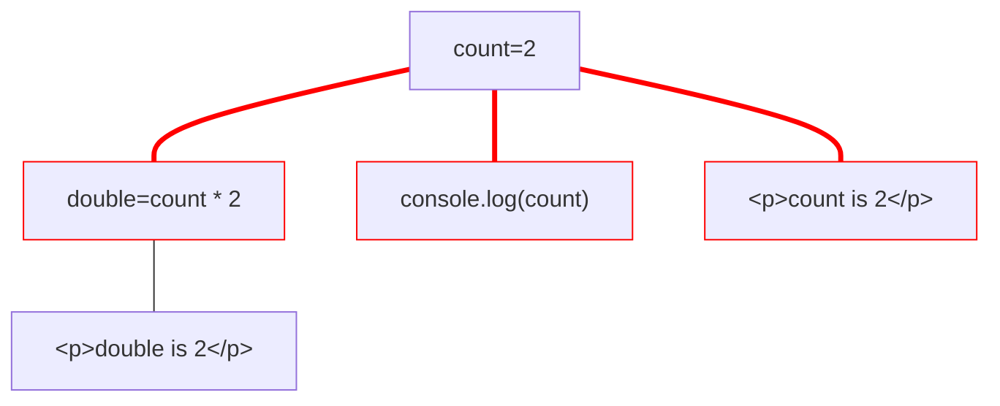
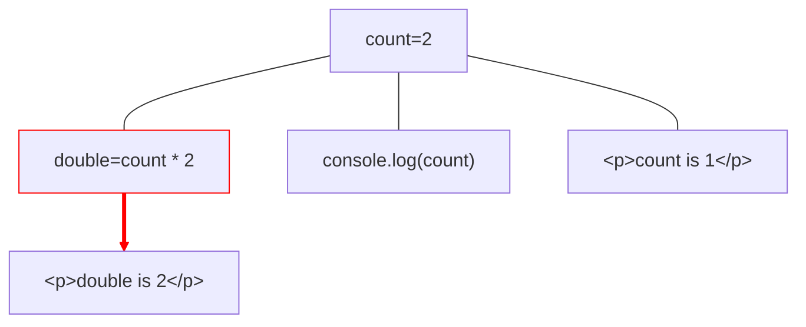
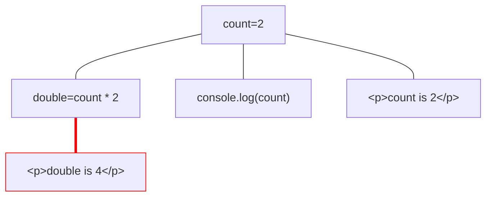

# What's the deal with signals?



---
layout: center
transition: fade
---

# What's the deal with signals?



---
layout: center
transition: fade
---

# What's the deal with signals?



---
layout: center
transition: fade
---

# What's the deal with signals?



---
layout: center
---

# What's the deal with signals?



---

# What's the deal with signals?

```js
function signal(value) {
  return {
    get value() {
      // track
      return value
    },
    set value(newValue) {
      value = newValue
      // notify all trackers
    }
  }
}
```