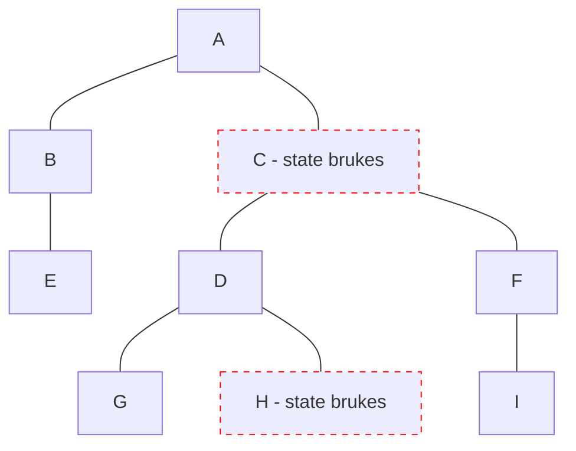

# Solid

- Signals 2021, v1

<logos-solidjs-icon class="text-9xl scale-200 translate-x-3em translate-y-60px" />

---

# Solid reaktivitet
 
```jsx {monaco}
import { createSignal, createEffect } from 'solid-js'

export function Component() {
  const [count, setCount] = createSignal(0)
  const double = () => count() * 2
  createEffect(() => console.log(double()))
  function increase() {
    setCount(count() + 1)
    // count = 1
    // double = 2
  }

  return (
    <>
      <p>Count: { count() }</p>
      <button onClick={increase}>Bump</button>
    </>
  )
}
```
<Copy framework="solid"/>

---
layout: center
---

# Solid re-render



---

# Solid oppsummering

|                                            | <logos-solidjs-icon class="text-5xl"/>                       |
| ------------------------------------------ | ------------------------------------------------------------ |
| mutable vs immutable API                   | <span v-click>Immutable</span>                               |
| Ummidelbar oppdatering                     | <emojione-white-heavy-check-mark v-click class="text-2xl"/>  |
| Re-render                                  | <material-symbols-jump-to-element v-click class="text-3xl"/> |
| Fungerer utenfor komponenten               | <emojione-white-heavy-check-mark v-click class="text-2xl"/>  |
| Fungerer utenfor rammeverk                 | <openmoji-palm-down-hand v-click class="text-2xl"/>          |

