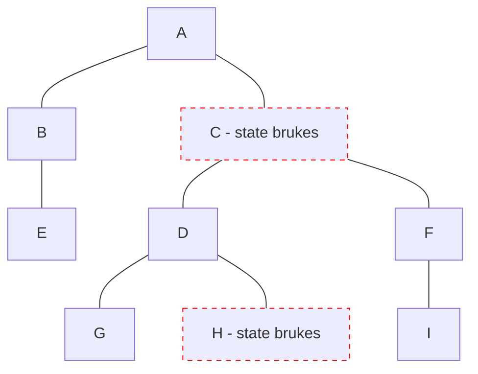

# Svelte

- Runes 202?, v5

<logos-svelte-icon class="text-9xl scale-200 translate-x-3em translate-y-60px" />

---

# Svelte 5 reaktivitet
 
```html {monaco}
<script>
	let count = $state(0)
  function increase() {
    count++
  }
</script>

<p>Count: { count }</p>
<button on:click={increase}>Bump</button>
```

---
layout: center
---

# Svelte 5 re-render



---

# Svelte 5 oppsummering

|                                            | <logos-svelte-icon class="text-5xl"/>                         |
| ------------------------------------------ | ------------------------------------------------------------- |
| mutable vs immutable API                   |  <span v-click>Mutable</span>                                 |
| Ummidelbar oppdatering                     |  <emojione-white-heavy-check-mark v-click class="text-2xl"/>  |
| Re-render                                  |  <material-symbols-jump-to-element v-click class="text-3xl"/> |
| Fungerer utenfor komponenten               |  <emojione-white-heavy-check-mark v-click class="text-2xl"/>  |
| Fungerer utenfor rammeverk                 |  <emojione-cross-mark-button v-click class="text-2xl"/>       |

