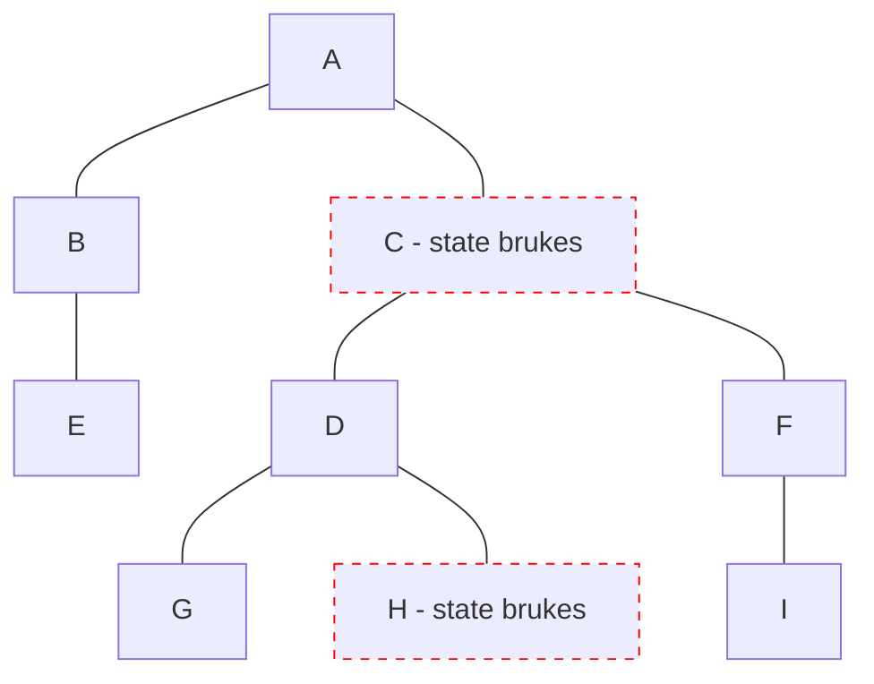

# Svelte

- Runes 202?, v5

<logos-svelte-icon class="text-9xl scale-200 translate-x-3em translate-y-60px" />

---
transition: fade
---

# Svelte 4 reaktivitet
 
```html
<script>
  let count = 0
  $: double = count * 2
  function increase() {
    count++
  }
</script>

<p>Count: { count }</p>
<button on:click={increase}>Bump</button>
```

---
transition: fade
---

# Svelte 5 reaktivitet
 
```html {2,3}
<script>
  let count = $state(0)
  const double = $derived(count * 2)
  function increase() {
    count++
  }
</script>

<p>Count: { count }</p>
<button on:click={increase}>Bump</button>
```

---
transition: fade
---

# Svelte 5 reaktivitet
 
```html {4}
<script>
  let count = $state(0)
  const double = $derived(count * 2)
  $effect(() => console.log(double))
  function increase() {
    count++
  }
</script>

<p>Count: { count }</p>
<button on:click={increase}>Bump</button>
```

---
transition: fade
---

# Svelte 5 reaktivitet
 
```html {6-8}
<script>
  let count = $state(0)
  const double = $derived(count * 2)
  $effect(() => console.log(double))
  function increase() {
    count++
    console.log(count) // 1
    console.log(double) // 2
  }
</script>

<p>Count: { count }</p>
<button on:click={increase}>Bump</button>
```

---
transition: fade
---

# Svelte 5 reaktivitet
 
```js
export let count = $state(0) // ❌
```

---

# Svelte 5 reaktivitet
 
```js
function createCounter() {
	let value = $state(0);

	return {
		get value() { 
			return value
		},
		set value(v){
			value = v
		}
   };
}

export const count = createCounter()
```

---
layout: center
---

# Svelte 5 re-render



---

# Svelte oppsummering

|                                            | <logos-svelte-icon class="text-5xl"/> v4                     | <logos-svelte-icon class="text-5xl"/> v5                     |
| ------------------------------------------ | ------------------------------------------------------------ | ------------------------------------------------------------ |
| mutable vs immutable API                   | <span v-click>Mutable</span>                                 | <span v-click>Mutable</span>                                 |
| State er alltid i sync                     | <emojione-cross-mark-button v-click class="text-2xl"/>       | <emojione-white-heavy-check-mark v-click class="text-2xl"/>  |
| Re-render                                  | <material-symbols-jump-to-element v-click class="text-3xl"/> | <material-symbols-jump-to-element v-click class="text-3xl"/> |
| Fungerer utenfor komponenten               | <emojione-cross-mark-button v-click class="text-2xl"/>       | <emojione-white-heavy-check-mark v-click class="text-2xl"/>  |
| Fungerer utenfor rammeverk                 | <emojione-cross-mark-button v-click class="text-2xl"/>       | <emojione-cross-mark-button v-click class="text-2xl"/>       |

