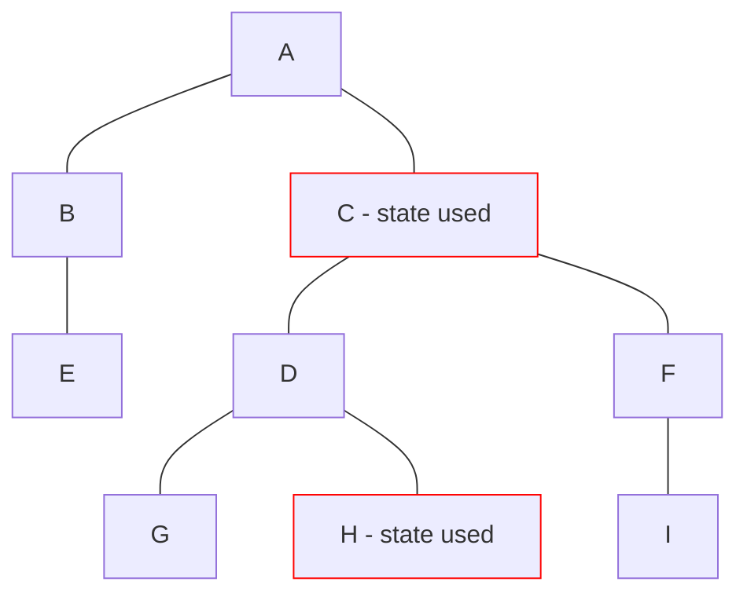

# Vue

- Composition API 2020, v3

<logos-vue class="text-9xl scale-200 translate-x-3em translate-y-60px" />

---
transition: fade
---

# Vue reactivity
 
```html
<script setup>
function increase() {
}
</script>

<template>
  <p>Count: 0</p>
  <button @click="increase">Bump</button>
</template>
```

---
transition: fade
---

# Vue reactivity
 
```html {2,4,6,11}
<script setup>
import { ref } from 'vue'

const count = ref(0)
function increase() {
  count.value++
}
</script>

<template>
  <p>Count: {{count}}</p>
  <button @click="increase">Bump</button>
</template>
```

---
transition: fade
---

# Vue reactivity
 
```html {2,4,6,11}
<script setup>
import { reactive } from 'vue'

const state = reactive({ count: 0})
function increase() {
  state.count++
}
</script>

<template>
  <p>Count: {{state.count}}</p>
  <button @click="increase">Bump</button>
</template>
```

---
transition: fade
---

# Vue reactivity
 
```html
<script setup>
import { ref } from 'vue'

const count = ref(0)
function increase() {
  count.value++
}
</script>

<template>
  <p>Count: {{count}}</p>
  <button @click="increase">Bump</button>
</template>
```

---
transition: fade
---

# Vue reactivity
 
```html {5}
<script setup>
import { ref, computed } from 'vue'

const count = ref(0)
const double = computed(() => count.value * 2)
function increase() {
  count.value++
}
</script>

<template>
  <p>Count: {{count}}</p>
  <button @click="increase">Bump</button>
</template>
```

---
transition: fade
---

# Vue reactivity
 
```html {6}
<script setup>
import { ref, computed, watchEffect } from 'vue'

const count = ref(0)
const double = computed(() => count.value * 2)
watchEffect(() => console.log(double))
function increase() {
  count.value++
}
</script>

<template>
  <p>Count: {{count}}</p>
  <button @click="increase">Bump</button>
</template>
```

---
transition: fade
---

# Vue reactivity
 
```html {8,9,10}
<script setup>
import { ref, computed, watchEffect } from 'vue'

const count = ref(0)
const double = computed(() => count.value * 2)
watchEffect(() => console.log(double))
function increase() {
  count.value++
  console.log(count.value) // 1
  console.log(double.value) // 2
}
</script>

<template>
  <p>Count: {{count}}</p>
  <button @click="increase">Bump</button>
</template>
```

---

# Vue reactivity

<p>state.js:</p>

```js
import { ref, computed, watchEffect } from 'vue'

export const count = ref(0)
const double = computed(() => count.value * 2)
watchEffect(() => console.log(double))
```

<p>Component.vue:</p>

```html {2}
<script setup>
import { count } from 'state.js'

function increase() {
  count.value++
}
</script>

<template>
  <p>Count: {{count}}</p>
  <button @click="increase">Bump</button>
</template>
```

<style>
  p {
    font-size: 0.7rem;
    opacity: 0.5;
    margin-bottom: 5px !important;
  }
</style>

---
layout: center
---

# Vue re-render



---

# Vue summary

|                                            | <logos-vue class="text-5xl"/>                                 |
| ------------------------------------------ | ------------------------------------------------------------- |
| mutable vs immutable API                   |  <span v-click>Mutable</span>                                 |
| State is always in sync                    |  <emojione-white-heavy-check-mark v-click class="text-2xl"/>  |
| Re-render                                  |  <openmoji-puzzle-piece v-click class="text-3xl"/>            |
| Works outside the component                |  <emojione-white-heavy-check-mark v-click class="text-2xl"/>  |
| Works outside the framework                |  <emojione-white-heavy-check-mark v-click class="text-2xl"/>  |

