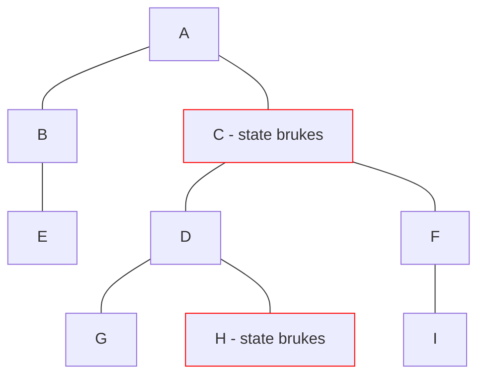

# Vue

- Composition API 2020, v3

<logos-vue class="text-9xl scale-200 translate-x-3em translate-y-60px" />

---

# Vue reaktivitet
 
```html {monaco}
<script setup>
import { ref } from 'vue'

const count = ref(0)
function increase() {
  count.value++
}
</script>

<template>
  <p>Count: {{ count }}</p>
  <button @click="increase">Bump</button>
</template>
```

---
layout: center
---

# Vue re-render



---

# Vue oppsummering

|                                            | <logos-vue class="text-5xl"/>                                 |
| ------------------------------------------ | ------------------------------------------------------------- |
| mutable vs immutable API                   |  <span v-click>Mutable</span>                                 |
| Ummidelbar oppdatering                     |  <emojione-white-heavy-check-mark v-click class="text-2xl"/>  |
| Re-render                                  |  <openmoji-puzzle-piece v-click class="text-3xl"/>            |
| Fungerer utenfor komponenten               |  <emojione-white-heavy-check-mark v-click class="text-2xl"/>  |
| Fungerer utenfor rammeverk                 |  <emojione-white-heavy-check-mark v-click class="text-2xl"/>  |

