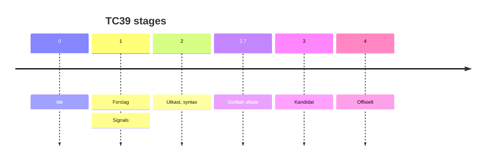

<div class="abs-br m-6 flex flex-col gap-2">
  <Homepage gradid="grad1"/>
  <Twitter />
</div>


---
transition: fade-out
---

<div class="row">
  <div class="column">
    
    <h1>Gaute Meek Olsen</h1>
  </div>
  
</div>

<div class="abs-br m-6 flex flex-col gap-2">
  <Homepage gradid="grad2"/>
  <Twitter />
</div>

<style>
.row{
  display: flex;
  justify-content: center;
  align-items: center;
  height: 100%;
  gap: 5rem;
}

.column{
  display: grid;
  place-items: center;
  gap: 10px;
}

img.me{
  height: 320px;
  border-radius: 40px;
  object-fit: contain;
}

img.capra {
  height: 250px;
  object-fit: contain;
}

h1{
  font-size: 3rem;
}
</style>

---

# Min fjerde JavaZone talk!

<ul>
  <li v-click>🧝 2021 - Nyheter i JavaScript - ES2021</li>
  <li v-click>🧙‍♀️ 2022 - Nyheter i JavaScript - ES2022</li>
  <li v-click>🤹 2023 - Nyheter i JavaScript - ES2023</li>
  <li v-click v-mark.crossed="{ color: 'red', strokeWidth: 8}">💾 2024 - Nyheter i JavaScript - ES2024</li>
  <li v-click="6">💾 2024 - Signals i frontend, og kan det bli en JavaScript standard?</li>
</ul>

<p v-click="7" class="translate-x-140 translate-y--11"><span v-mark.crossed="{ at: 8, color: 'red'}">(no)</span></p>
<p v-click="9" class="translate-x-150 translate-y--21">(yes?)</p>

<style>
h1 {
  background-color: #2B90B6;
  background-image: linear-gradient(45deg, #4EC5D4 10%, #9fd6eb 20%);
  background-size: 100%;
  -webkit-background-clip: text;
  -moz-background-clip: text;
  -webkit-text-fill-color: transparent;
  -moz-text-fill-color: transparent;
}

li {
  width: fit-content;
}
</style>

---
layout: center
---

# 👇 Frykt ikke 👇
## Nyheter i JavaScript - ES2024

<figure>
  
  <figcaption>https://gaute.dev/dev-blog</figcaption>
</figure>

<style>
  img {
    width: 300px;
  }
  h1, h2, figcaption {
    text-align: center;
    margin-top: 10px;
  }
  figure {
    display: grid;
    place-items: center;
  }
</style>

---

# Signals i frontend, og kan det bli en JavaScript standard?

<p>
Hva er <span v-mark.blue>signals?</span>
</p>

<style>
  p {
    opacity: 1 !important;
    text-align: center;
    margin-top: 10rem !important;
    font-size: 2rem;
  }
</style>

---
layout: center
---

<h2>
Signals = en type implementasjon av reaktivitet
</h2>

<p v-click="1">
Hva er <span v-mark.blue="1">reaktivitet?</span>
</p>


<style>

  p {
    text-align: center;
    margin-top: 5rem !important;
    font-size: 1.5rem;
  }
</style>

---
clicks: 1
---

<p v-motion :initial="{ x: 0, y: 0}" :click-1="{ x: -250, y: -160 }">
Hva er <span v-mark.blue="1">ikke reaktivit?</span>
</p>

<div v-click="1" class="code">

```js {monaco-run} {autorun:false, height: 'auto' }
let epler = 5
let appelsiner = 5
let frukt = epler + appelsiner
epler += 10

console.log(frukt)
```

</div>

<style>
  p {
    opacity: 1 !important;
    text-align: center;
    margin-top: 10rem !important;
    font-size: 2rem;
  }

  .code {
    margin-top: -50px;
  }
</style>

---
clicks: 1
---

<p v-motion :initial="{ x: 0, y: 0}" :click-1="{ x: -250, y: -160 }">
Hva er <span v-mark.blue="1">reaktivitet?</span>
</p>

<div v-click="1">

<SpreadSheet />

</div>

<style>
  p {
    opacity: 1 !important;
    text-align: center;
    margin-top: 10rem !important;
    font-size: 2rem;
  }
</style>

---

# Flere måter å oppnå reaktivitet på

<v-clicks>

- Dirty checking (<vscode-icons-file-type-angular />)
- Re-run everything (<logos-react />)
- Compile based reactivity (<logos-svelte-icon />)
- Signals

</v-clicks>

---
clicks: 1
---

<p v-motion :initial="{ x: 0, y: 0}" :click-1="{ x: -250, y: -160 }">
Hva er <span v-mark.blue="1">signals?</span>
</p>

<div v-click="1" class="translate-y--30">
  <p>State sier selv ifra når den er endret</p>
</div>

<style>
  p {
    opacity: 1 !important;
    text-align: center;
    margin-top: 10rem !important;
    font-size: 2rem;
  }
</style>

---
src: ./pages/signal-tree.md
transition: fade
---


---

# Timeline

<arrow x1="50" y1="250" x2="850" y2="250" color="#d6d600" width="2" arrowSize="1" />

<span class="absolute translate-x-10 translate-y-40">2010</span>
<logos-knockout class="absolute translate-x-1 translate-y-30 text-xl"/>
<span class="absolute translate-x-30 translate-y-40">2012</span>
<logos-meteor-icon class="absolute translate-x-32 translate-y-30 text-xl"/>
<span class="absolute translate-x-50 translate-y-40">2014</span>
<logos-vue class="absolute translate-x-52 translate-y-30 text-xl opacity-60"/>
<span class="absolute translate-x-100 translate-y-40">2020</span>
<logos-vue class="absolute translate-x-102 translate-y-30 text-xl"/>
<span class="absolute translate-x-120 translate-y-40">2021</span>
<logos-solidjs-icon class="absolute translate-x-122 translate-y-30 text-xl"/>
<span class="absolute translate-x-140 translate-y-40">2022</span>
<logos-preact class="absolute translate-x-143 translate-y-30 text-xl"/>
<span class="absolute translate-x-160 translate-y-40">2023</span>
<logos-qwik-icon class="absolute translate-x-160 translate-y-30 text-xl"/>
<logos-angular-icon class="absolute translate-x-167 translate-y-30 text-xl"/>
<logos-svelte-icon class="absolute translate-x-203 translate-y-30 text-xl"/>

<span v-click class="absolute translate-x-116 translate-y-65 rotate-50">La oss kalle dette signals</span>


---
layout: center
---

# JavaScript Signals standard proposal


[github.com/tc39/proposal-signals](https://github.com/tc39/proposal-signals)

<style>
  div {
    text-align: center;
  }

  img {
    margin: 0 auto;
  }
</style>

---

## TC39 proposal

<style>
  h2 {
    margin-bottom: 5rem;
  }
</style>

```js {1|1-3|5|7}
const count = new Signal.State(0)
console.log(count.get())
console.log(count.set(1))

const double = new Signal.Computed(() => count.get() * 2)

new Signal.subtle.Watcher
```

---

<p class="translate-x--62 translate-y--40">
TC39 proposal - <span v-mark.blue="0" class="normal">eksempel 1</span>
</p>

<style>
  p {
    opacity: 1 !important;
    text-align: center;
    margin-top: 10rem !important;
    font-size: 2rem;
  }
</style>

````md magic-move
```js
let epler = 5
let appelsiner = 5
let frukt = epler + appelsiner
epler += 10

console.log(frukt)
```
```js
const epler = new Signal.State(5)
const appelsiner = new Signal.State(5)
let frukt = epler + appelsiner
epler += 10

console.log(frukt)
```
```js
const epler = new Signal.State(5)
const appelsiner = new Signal.State(5)
let frukt = epler.get() + appelsiner.get()
epler += 10

console.log(frukt)
```
```js
const epler = new Signal.State(5)
const appelsiner = new Signal.State(5)
let frukt = epler.get() + appelsiner.get()
epler.set(epler.get() + 10)

console.log(frukt)
```
```js
const epler = new Signal.State(5)
const appelsiner = new Signal.State(5)
const frukt = new Signal.Computed(() => epler.get() + appelsiner.get())
epler.set(epler.get() + 10)

console.log(frukt)
```
```js
const epler = new Signal.State(5)
const appelsiner = new Signal.State(5)
const frukt = new Signal.Computed(() => epler.get() + appelsiner.get())
epler.set(epler.get() + 10)

console.log(frukt.get()) // 20
```
````

---
layout: two-cols
---

<p class="translate-y--40">
TC39 proposal - <span v-mark.blue="0" class="normal">eksempel 2</span>
</p>

<style>
  p {
    opacity: 1 !important;
    text-align: center;
    margin-top: 10rem !important;
    font-size: 2rem;
    margin-bottom: -80px;
  }
</style>

```js
import { effect } from './utils'

const count = new Signal.State(0)

const button = document.querySelector('#count')
button.addEventListener('click', () => {
  count.set(count.get() + 1)
})

effect(() => {
  button.textContent = count.get()
})
```

::right::

<Counter />

---

# Fordeler med å gjøre det til en standard

- Mindre behov for rammeverk/bibliotek?
- Hvert rammeverk kan minske i kB
- Felles utils-biblioteker

<div v-click>
  <code class="translate-x-29 translate-y-10 inline-block">useQuery()</code>
  <code class="translate-x-10 translate-y-35 inline-block">useLocalStorage()</code>
  <code class="translate-x-10 translate-y-17 inline-block">useMousePosition()</code>
  <code class="translate-x-10 translate-y-30 inline-block">useScreenSize()</code>
</div>

---



<p v-click>Gjennomsnittlig 3,6 år</p>

<!--
https://tc39.es/process-document/
-->

---

# Alternativer i dag
- Velg et rammeverk med signals (<logos-vue />, <logos-solidjs-icon />, <logos-preact />, <logos-angular-icon />, <logos-qwik-icon />, <logos-svelte-icon class="opacity-60" />)
- Eller benytt disse pakkene:
  - `npm i @vue/reactivity`
  - `npm i @preact/signals`
- Polyfill: `npm i signal-polyfill`

---
layout: center
---

# Takk for meg

<div class="abs-br m-6 flex flex-col gap-2">
  <Homepage gradid="grad1"/>
  <Twitter />
</div>
