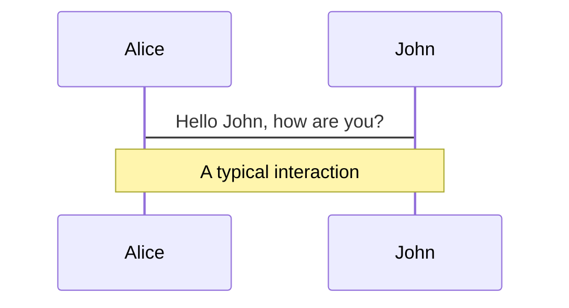
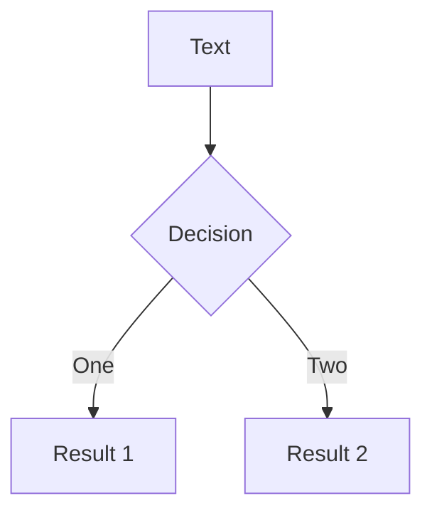
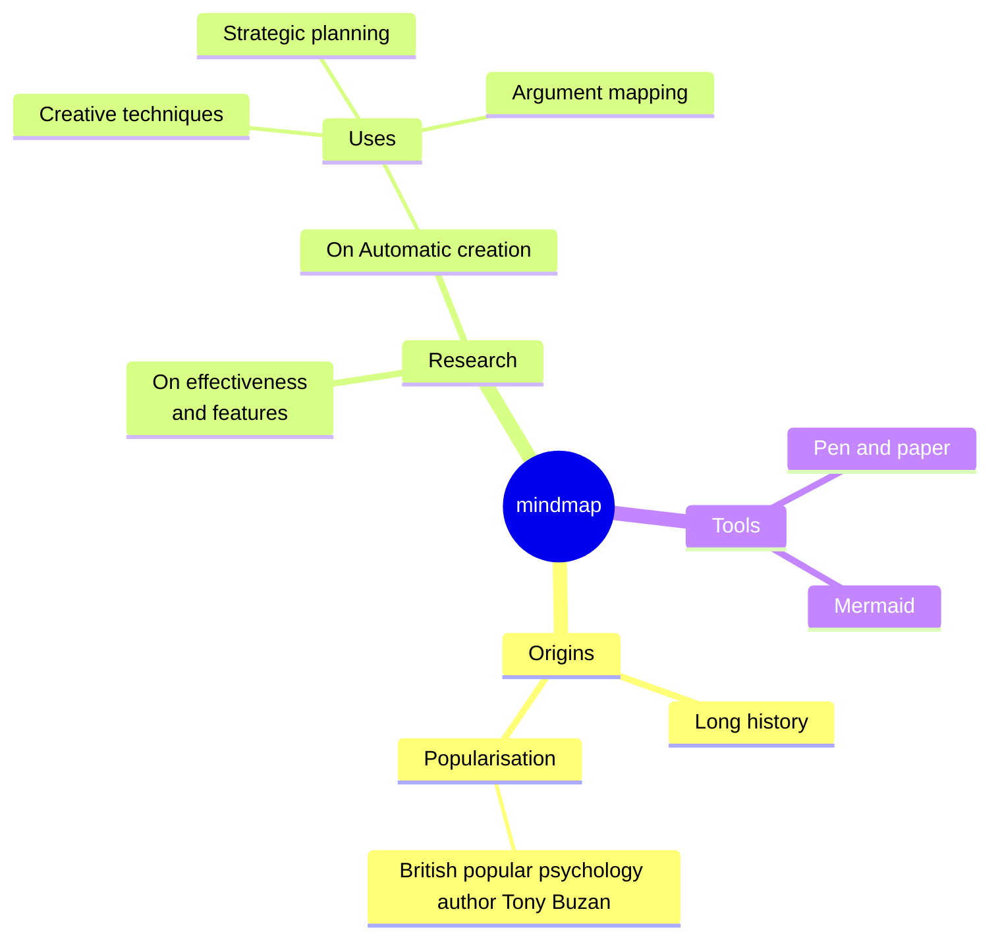
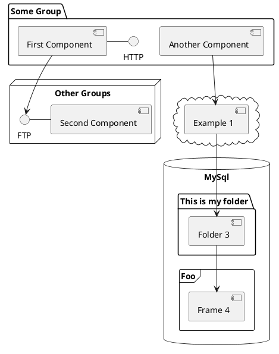

<h1><span>Visual</span>, <span>automated</span>, and <span>fast</span> component testing with Vitest</h1>

<div class="abs-br m-6 text-xl">
  <Homepage/>
</div>

<style>
  h1 {
    font-size: 2rem;

    span {
      font-weight: bold;
    }

    span:nth-child(1) {
      background: linear-gradient(120deg, #f093fb 0%, #f5576c 100%);
      -webkit-background-clip: text;
      -webkit-text-fill-color: transparent;
    }
    span:nth-child(2) {
      background: linear-gradient(
        90deg,
        #fff 0%,
        #ffffff 38%,
        #000 40%,
        #ffffff 42%,
        #fff 100%
      );
      background-size: 200% auto;
      -webkit-background-clip: text;
      -webkit-text-fill-color: transparent;
      animation: shimmer 3s linear infinite;
    }
    span:nth-child(3) {
      text-shadow:
        0 3px 20px red,
        0 0 20px red,
        0 0 10px orange,
        4px -5px 6px yellow,
        -4px -10px 10px yellow,
        0 -10px 30px yellow;
      animation: 2s Blazing infinite alternate linear;
    }

    @keyframes shimmer {
      0% { background-position: 200% center; }
      100% { background-position: -200% center; }
    }

    @keyframes Blazing {
      0% {
        text-shadow:
          0 3px 20px red,
          0 0 20px red,
          0 0 10px orange,
          0 0 0 yellow,
          0 0 5px yellow,
          -2px -5px 5px yellow,
          4px -10px 10px yellow;
      }
      25% {
        text-shadow:
          0 3px 20px red,
          0 0 30px red,
          0 0 20px orange,
          0 0 5px yellow,
          -2px -5px 5px yellow,
          3px -10px 10px yellow,
          -4px -15px 20px yellow;
      }
      50% {
        text-shadow:
          0 3px 20px red,
          0 0 20px red,
          0 -5px 10px orange,
          -2px -5px 5px yellow,
          3px -10px 10px yellow,
          -4px -15px 20px yellow,
          2px -20px 30px rgba(255, 255, 0, 0.5);
      }
      75% {
        text-shadow:
          0 3px 20px red,
          0 0 20px red,
          0 -5px 10px orange,
          3px -5px 5px yellow,
          -4px -10px 10px yellow,
          2px -20px 30px rgba(255, 255, 0, 0.5),
          0px -25px 40px rgba(255, 255, 0, 0);
      }
      100% {
        text-shadow:
          0 3px 20px red,
          0 0 20px red,
          0 0 10px orange,
          0 0 0 yellow,
          0 0 5px yellow,
          -2px -5px 5px yellow,
          4px -10px 10px yellow;
      }
    }
  }

  @keyframes spread {
    0%, 10% {
      transform: scale(0);
    }
    25% {
      transform: scale(1.2) rotate(40deg);
    }
    50% {
      transform: scale(1.2) rotate(40deg) skewX(-25deg);
    }
  }
</style>

---

# But first

<v-clicks>

 - Do we really need to test our frontend code?
 - Do you test your frontend code?

</v-clicks>

---

# The testing pyramid

<section>
  <v-clicks>

  
  
  
  
  
  
  
  <p class="translate-y--20"><b>Key takeaway:</b>Test pyramids are difficult.</p>

  </v-clicks>
</section>

<style>
  section {
    display: grid;
    place-items: center;
    height: 400px;

    img, p {
      grid-row: 1;
      grid-column: 1;
    }
  }

  p {
    background-color: #044f87;
    padding: 2rem;
    border-radius: 2px;
    z-index: 100;
    font-size: 2rem;
    line-height: 2rem;

    b {
      display: block;
    }
  }
</style>

---

# What is component testing?

<v-clicks>

> Component testing sits between unit tests and end-to-end tests  
> — *Vitest docs*

## What is unit testing?

> unit tests are low-level, focusing on a small part of the software system  
> — *Martin Fowler*

## What is end to end testing?

Browser renders the web page to user flows.

</v-clicks>


---
layout: iframe

url: http://localhost:5173
---
---

# What is component testing?

Renders just the component to test component behaviour.

---

# Frontend test pyramid?


<p v-click class="translate-y--50"><b>Key takeaway:</b>Test pyramids are difficult.</p>

<style>
  p {
  background-color: #044f87;
  padding: 2rem;
  border-radius: 2px;
  z-index: 100;
  font-size: 2rem;
  line-height: 2rem;

  b {
    display: block;
  }
}
</style>

---

# The rule of frontend testing

1. If it renders the test should run in a browser

---
class: px-20
---

# Themes

Slidev comes with powerful theming support. Themes can provide styles, layouts, components, or even configurations for tools. Switching between themes by just **one edit** in your frontmatter:

<div grid="~ cols-2 gap-2" m="t-2">

```yaml
---
theme: default
---
```

```yaml
---
theme: seriph
---
```


</div>

Read more about [How to use a theme](https://sli.dev/guide/theme-addon#use-theme) and
check out the [Awesome Themes Gallery](https://sli.dev/resources/theme-gallery).

---

# Clicks Animations

You can add `v-click` to elements to add a click animation.

<div v-click>

This shows up when you click the slide:

```html
<div v-click>This shows up when you click the slide.</div>
```

</div>

<br>

<v-click>

The <span v-mark.red="3"><code>v-mark</code> directive</span>
also allows you to add
<span v-mark.circle.orange="4">inline marks</span>
, powered by [Rough Notation](https://roughnotation.com/):

```html
<span v-mark.underline.orange>inline markers</span>
```

</v-click>

<div mt-20 v-click>

[Learn more](https://sli.dev/guide/animations#click-animation)

</div>

---

# Motions

Motion animations are powered by [@vueuse/motion](https://motion.vueuse.org/), triggered by `v-motion` directive.

```html
<div
  v-motion
  :initial="{ x: -80 }"
  :enter="{ x: 0 }"
  :click-3="{ x: 80 }"
  :leave="{ x: 1000 }"
>
  Slidev
</div>
```

<div class="w-60 relative">
  <div class="relative w-40 h-40">
    
    
    
  </div>

  <div
    class="text-5xl absolute top-14 left-40 text-[#2B90B6] -z-1"
    v-motion
    :initial="{ x: -80, opacity: 0}"
    :enter="{ x: 0, opacity: 1, transition: { delay: 2000, duration: 1000 } }">
    Slidev
  </div>
</div>

<!-- vue script setup scripts can be directly used in markdown, and will only affects current page -->
<script setup lang="ts">
const final = {
  x: 0,
  y: 0,
  rotate: 0,
  scale: 1,
  transition: {
    type: 'spring',
    damping: 10,
    stiffness: 20,
    mass: 2
  }
}
</script>

<div
  v-motion
  :initial="{ x:35, y: 30, opacity: 0}"
  :enter="{ y: 0, opacity: 1, transition: { delay: 3500 } }">

[Learn more](https://sli.dev/guide/animations.html#motion)

</div>

---

# $\LaTeX$

$\LaTeX$ is supported out-of-box. Powered by [$\KaTeX$](https://katex.org/).

<div h-3 />

Inline $\sqrt{3x-1}+(1+x)^2$

Block
$$ {1|3|all}
\begin{aligned}
\nabla \cdot \vec{E} &= \frac{\rho}{\varepsilon_0} \\
\nabla \cdot \vec{B} &= 0 \\
\nabla \times \vec{E} &= -\frac{\partial\vec{B}}{\partial t} \\
\nabla \times \vec{B} &= \mu_0\vec{J} + \mu_0\varepsilon_0\frac{\partial\vec{E}}{\partial t}
\end{aligned}
$$

[Learn more](https://sli.dev/features/latex)

---

# Diagrams

You can create diagrams / graphs from textual descriptions, directly in your Markdown.

<div class="grid grid-cols-4 gap-5 pt-4 -mb-6">









</div>

Learn more: [Mermaid Diagrams](https://sli.dev/features/mermaid) and [PlantUML Diagrams](https://sli.dev/features/plantuml)

---
foo: bar
dragPos:
  square: 691,32,167,_,-16
---

# Draggable Elements

Double-click on the draggable elements to edit their positions.

<br>

###### Directive Usage

```md

```

<br>

###### Component Usage

```md
<v-drag text-3xl>
  <div class="i-carbon:arrow-up" />
  Use the `v-drag` component to have a draggable container!
</v-drag>
```

<v-drag pos="663,206,261,_,-15">
  <div text-center text-3xl border border-main rounded>
    Double-click me!
  </div>
</v-drag>


###### Draggable Arrow

```md
<v-drag-arrow two-way />
```

<v-drag-arrow pos="67,452,253,46" two-way op70 />

---
src: ./pages/imported-slides.md
hide: false
---

---

# Monaco Editor

Slidev provides built-in Monaco Editor support.

Add `{monaco}` to the code block to turn it into an editor:

```ts {monaco}
import { ref } from 'vue'
import { emptyArray } from './external'

const arr = ref(emptyArray(10))
```

Use `{monaco-run}` to create an editor that can execute the code directly in the slide:

```ts {monaco-run}
import { version } from 'vue'
import { emptyArray, sayHello } from './external'

sayHello()
console.log(`vue ${version}`)
console.log(emptyArray<number>(10).reduce(fib => [...fib, fib.at(-1)! + fib.at(-2)!], [1, 1]))
```

---
layout: center
class: text-center
---

# Learn More

[Documentation](https://sli.dev) · [GitHub](https://github.com/slidevjs/slidev) · [Showcases](https://sli.dev/resources/showcases)

<PoweredBySlidev mt-10 />
