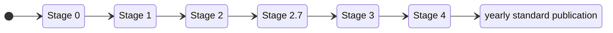

# TC39 process

```mermaid
stateDiagram-v2 
    direction LR
    state "Stage 0" as 0
    state "Stage 1" as 1
    state "Stage 2" as 2
    state "Stage 2.7" as 27
    state "Stage 3" as 3
    state "Stage 4" as 4
    state "yearly standard publication" as r
    [*] --> 0
    0 --> 1
    1 --> 2
    2 --> 27
    27 --> 3
    3 --> 4
    4 --> r
```
